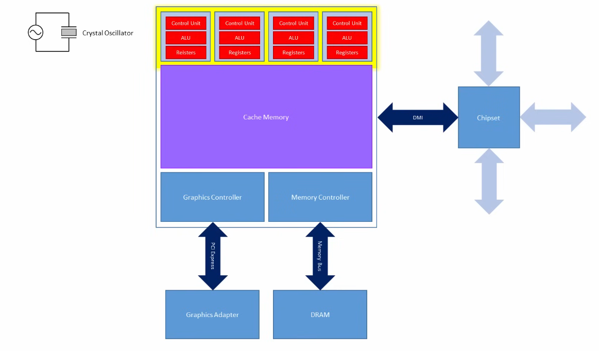
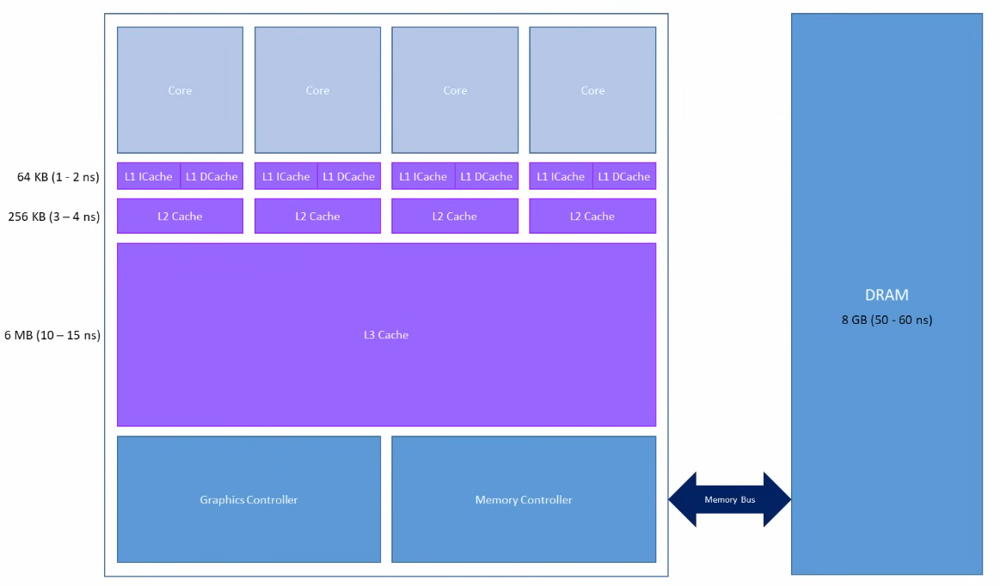
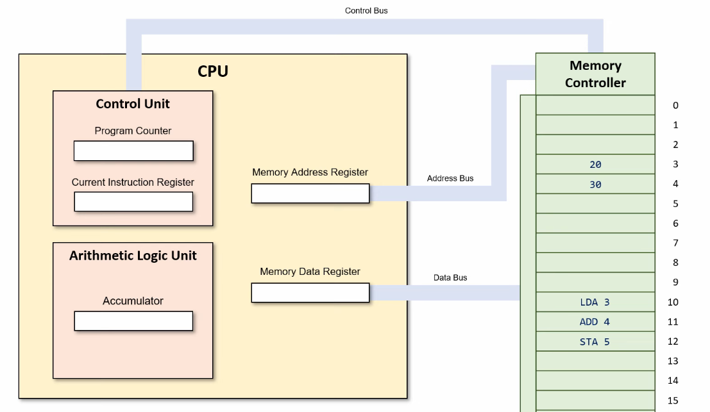

<!-- 
 -->

# [Base Clock](https://www.youtube.com/watch?v=Uuo5oZ-yHHM)

#### **The Heart: The Quartz Crystal**

*   **The Component:** On every motherboard, you'll find a small, silver, metal-can component. This is the **quartz crystal oscillator**. It's often labeled with its frequency, like "24.000" or "25.000" MHz.
*   **The Physics - Piezoelectric Effect:** Quartz crystal has a special property: if you apply a voltage to it, it physically vibrates at an incredibly stable and precise frequency. Conversely, when you mechanically squeeze it, it generates a voltage. This is called the **piezoelectric effect**.
*   **The Signal:** This vibration is used to generate a very clean and steady oscillating electronic signal at the crystal's fundamental frequency. This is the raw, foundational timing signal for the entire motherboard.

### **Summary: The Chain of Time**

1.  **Clock Generator IC:** A dedicated chip uses PLLs to multiply and condition the crystal's signal into multiple, clean, square-wave digital clocks.
2.  **Distribution:** These new clocks (including the crucial 100 MHz BCLK) are sent across the motherboard to all components.
3.  **CPU Usage:** The CPU uses its received BCLK and its internal multiplier to set its final core clock speed: `Core Speed = BCLK × Multiplier`.
    *   Example: 100 MHz (BCLK) x 42 (Multiplier) = 4200 MHz or 4.2 GHz.

### **The Modern Twist: Separated Base Clocks**

On very modern systems (Intel Skylake and later, AMD Ryzen), the concept of BCLK has evolved. Instead of a single clock governing everything, the architecture uses **separ clock domains**.

*   A ~100 MHz clock is still generated for the CPU cores themselves.
*   But other parts of the system, like the PCIe bus and SATA controllers, now run on their own, independent, and *asynchronous* clocks (e.g., a fixed 100 MHz for PCIe, a fixed 24 MHz for USB).

**Why is this important for overclocking?**
In the old architecture, raising the BCLK to overclock the CPU would also overclock the PCIe bus (affecting your GPU, SSD, and network card) and SATA controllers (affecting your hard drives), often causing system instability long before the CPU itself became unstable.

With separated clock domains, you can now increase the CPU's BCLK to, say, 102 MHz to get a minor overclock without affecting the stability of your GPU, SSD, or other components, as their clocks remain locked to their own independent oscillators. This allows for finer-grained and more stable tuning.

### **Overclocking**

The goal is to force the component to perform more operations per second, thereby gaining more performance without buying a new, more expensive part.

**The Act of Overclocking:** An overclocker enters the computer's BIOS/UEFI (the low-level software that controls the hardware) and does **one or both** of the following:
*   **Increases the CPU Multiplier:** This is the most common and stable method on modern "unlocked" CPUs (e.g., Intel's "K-series" or AMD's "Black Edition" CPUs).
*   **Increases the Base Clock (BCLK):** This is a more complex method as it affects the speed of other components connected to the motherboard (like RAM and PCIe devices) and is often used for more extreme overclocking.

By increasing either value, you are telling the components to perform their actions *more times per second*.

**The Trade-off:** You exchange **increased heat, power consumption, and risk of instability/hardware damage** for the gained performance.

## [Level-Sensitive vs. Edge-Sensitive](https://youtu.be/PVNAPWUxZ0g?si=foz30b8XaW_THWFU&t=279)

The most critical distinction is how they respond to the clock signal.

*   **[Latches](https://youtu.be/-aQH0ybMd3U?si=1IVeNAmWwrf18sMd&t=146)** are **level-sensitive**. They are transparent and continuously pass the input to the output as long as the clock signal is at a specific level (high or low).
*   **Flip-Flops** are **edge-triggered**. They sample the input and change their output *only* at the precise moment the clock signal changes from one level to another (the rising or falling edge).

| Feature | Latch | Flip-Flop |
| :--- | :--- | :--- |
| **Clock Triggering** | **Level-sensitive** (Transparent on HIGH or LOW) | **Edge-triggered** (Changes on RISING or FALLING edge) |
| **Operation** | Acts like a gate. When enabled, output follows input. | Acts like a storage cell. Captures input value at a moment. |
| **Circuit** | Simpler, built from basic gates (e.g., 2 NAND/NOR gates for SR Latch). | More complex. Often built from two latches in series (Master-Slave configuration). |
| **Output Changes** | Multiple times while clock is active (if input changes). | **Only once per clock cycle**, at the active clock edge. |
| **Usage** | Less common in modern, synchronous design. Used in async circuits, bus arbitration, and as building blocks for FFs. | **The fundamental building block of synchronous digital design** (CPUs, FPGAs, etc.). |
| **Power Consumption** | Generally lower (fewer transistors). | Generally higher due to more complex internal circuitry. |

## **Comparison Table: SRAM vs. [DRAM](https://youtu.be/-Df09el4yDU?si=aTHQpSdiMQL13Jao)**

| Feature | **SRAM** (Used for Cache) | **[DRAM](https://youtu.be/7WnbIeMgWYA?si=zsxqIz3ydKiUVflz)** (Used for Main RAM) |
| :--- | :--- | :--- |
| **Cell Structure** | 6 transistors (Flip-flop) | 1 transistor + 1 capacitor |
| **Refresh Needed?** | **No** | **Yes** (constant refreshing, every `64ms`) |
| **Speed** | **Very Fast** (Low latency) | **Slower** (Higher latency) |
| **Cost** | Expensive | Cheap |
| **Density** | Low (large cell size) | High (small cell size) |
| **Power Usage** | Low (standby), High (active) | Moderate (active + refresh) |
| **Primary Role** | CPU Cache | Main System Memory |64 ms

When a CPU needs data, it checks the memory hierarchy in order:
1.  **L1 Cache:** Is the data here? If yes (**hit**), it's retrieved in a few cycles. If no (**miss**)...
2.  **L2 Cache:** Check here. Hit? Retrieve. Miss?...
3.  **L3 Cache:** Check here. Hit? Retrieve. Miss?...
4.  **Main Memory (DRAM):** Go to RAM, which is much slower. The required data is fetched and a copy is placed into all levels of cache (based on the caching algorithm) in case it's needed again soon.
5.  **Storage (SSD/HDD):** If the data isn't in RAM either (a **page fault**), it must be loaded from the painfully slow storage drive into RAM first, then into the cache, and finally to the CPU.

# [Computer Hardware and Architecture](https://www.youtube.com/playlist?list=PLTd6ceoshprfg23JMtwGysCm4tlc0I1ou)

 

### **1. Registers**

They are the fastest form of storage in a computer system, much faster than RAM or cache.

A **word** is a fundamental unit of data that a CPU can process at once. It's the size of the data registers inside the CPU and influences the amount of memory that can be directly accessed. A 64-bit CPU has 64-bit wide registers. 

| Register Type | Acronym | Primary Function |
| :--- | :--- | :--- |
| **Program Counter** | PC/IP | Holds the memory address (**pointer**) of the **next instruction** to be fetched from memory. |
| **Instruction Register** | IR | Holds the **actual instruction** currently being decoded and executed. |
| **Memory Address Register** | MAR | Holds the **address in memory** that the CPU wants to read from or write to. |
| **Memory Buffer/Data Register** | MBR/MDR | Holds the **actual data** that has been read from or is about to be written to the memory address in the MAR. |
| **Accumulator** | ACC | A special register used to store the **results** of calculations performed by the ALU. (More common in older architectures). |
| **General-Purpose Registers** | (e.g., RAX, RBX) | Used for a variety of purposes, such as storing operands for arithmetic operations or temporary data. Modern CPUs have multiple. |
| **Status/Flag Register** | FLAGS | Contains individual **bits (flags)** that indicate the status of the CPU or the result of the last ALU operation. Common flags: |
| | **Zero Flag (Z)** | Set to 1 if the result of an operation is zero. |
| | **Carry Flag (C)** | Set to 1 if an operation results in a carry out of or borrow into the highest-order bit. |
| | **Sign Flag (S)** | Set to 1 if the result of an operation is negative. |
| | **Overflow Flag (O)** | Set to 1 if an arithmetic overflow occurs (result is too large to be represented). |
| **Stack Pointer** | SP | Points to the top of the **stack** (a special region of memory for temporary data and return addresses). |
| **Shadow Registers** | Hidden | Temporary registers that are **not** part of the **programmer-visible** architecture. |
| **Link Register** | LR (Arm) | Holds the address to return to when a subroutine call completes. |
| **Task Register** | TR (x86) | Points to the current task's Task State Segment (TSS). |
---

### **2. Arithmetic Logic Unit (ALU)**

*   It is a **combinational circuit**, meaning its output is purely a function of its current inputs (after a brief propagation delay).
*   It has no internal storage.
*   Its operation is directed by the **Control Unit**.

#### **Functions of the ALU:**

| Category | Operations | Description |
| :--- | :--- | :--- |
| **Arithmetic Operations** | Addition, Subtraction | Fundamental math operations. Multiplication and division are often performed using a series of additions/subtractions and shifts, though modern CPUs may have dedicated circuits. |
| **Logical Operations** | AND, OR, NOT, XOR, NAND, NOR | Bit-wise operations performed on binary data. Crucial for decision-making and data manipulation. |
| **Bit-Shifting Operations** | Logical Shift, Arithmetic Shift, Rotate | Moves the bits in a word left or right. Used for quick multiplication/division by powers of two and data manipulation. |
| **Comparison** | Compare (CMP) | Typically done via a subtraction operation. The result is discarded, but the **Status Flags** are set based on the outcome (e.g., Zero flag set if the two values are equal). |

**How it Works:**
1.  The ALU takes **two inputs** (operands) from registers or the internal data bus.
2.  It receives a **control signal** from the Control Unit telling it which operation to perform (e.g., "add," "AND").
3.  It performs the operation on the inputs.
4.  It outputs the **result** of the operation, which is usually stored back in a register (like the **Accumulator**).
5.  It outputs **status information** (flags like Zero, Carry) to the Status Register.

---

### **3. Control Unit (CU)**

**Definition:** The Control Unit is the component that **directs and coordinates** the entire computer system. It does not execute programs or process data itself; instead, it acts as the central nervous system, managing the fetch-decode-execute cycle and generating the control signals that tell all other components what to do and when to do it.

**Key Characteristics:**
*   It is the "**conductor of the orchestra**."
*   It interprets (decodes) instructions from the Instruction Register (IR).
*   It uses a **timer (clock signal)** to synchronize all operations.

#### **Primary Functions of the Control Unit:**

1.  **Instruction Fetch:** It instructs the memory hardware to read the instruction at the address stored in the Program Counter (PC). This instruction is placed into the Instruction Register (IR). The PC is then incremented to point to the next instruction.
2.  **Instruction Decode:** The CU **decodes** the instruction in the IR. It determines what operation is requested (the **opcode**) and what data (operands) it needs to act upon.
3.  **Operand Fetch:** If needed, the CU coordinates the fetching of any required data from memory or registers, placing it into the appropriate registers for the ALU to use.
4.  **Execution:** The CU **sends control signals** to the ALU and other components to perform the actual operation. For example, it tells the ALU to "add" the contents of two specific registers.
5.  **Result Store:** The CU directs the writing of the result (from the ALU or elsewhere) back to a register or to memory.
6.  **Manages Control Signals:** It generates the electronic signals that control the flow of data through the **internal buses** (data bus, address bus, control bus) between the CPU, memory, and I/O devices.

---

### **How They Work Together: [The Fetch-Decode-Execute Cycle](https://youtu.be/ByllwN8q2ss?si=eMBfKTcB6V5Ijl6-&t=446)**

Let's trace a simple instruction `ADD [A], B` (Add the value in memory location A to the value in register B, store result in B) to see how these components interact.

1.  **Fetch:**
    *   The **Control Unit** reads the address in the **Program Counter (PC)**.
    *   It places this address into the **Memory Address Register (MAR)**.
    *   It sends a "Memory Read" signal.
    *   The instruction at that address is fetched from memory and placed into the **Memory Buffer Register (MBR)**.
    *   The instruction is copied from the MBR to the **Instruction Register (IR)**.
    *   The PC is incremented to point to the next instruction.

2.  **Decode:**
    *   The **Control Unit** decodes the instruction in the **IR**. It sees it is an `ADD` operation that requires a value from memory.

3.  **Execute - Operand Fetch:**
    *   The CU places the memory address `[A]` (from the instruction) into the **MAR**.
    *   It sends another "Memory Read" signal.
    *   The data at address `A` is fetched from memory into the **MBR**.

4.  **Execute - Operation:**
    *   The CU directs one operand (from the **MBR**) to be moved to an ALU input register.
    *   The other operand (the value in register `B`) is moved to the other ALU input register.
    *   The CU sends a control signal to the **ALU** telling it to **ADD** the two values.
    *   The ALU performs the addition and outputs the result.
    *   The result is stored back into register `B`.
    *   The ALU updates the **Status Flags** (e.g., Zero Flag is set to 0 because the result was not zero).

5.  The cycle repeats, fetching the next instruction from the address now in the PC.

# [CPU Visual Simulator](https://cpuvisualsimulator.github.io/)
# [CPU Visual Simulator](https://tinycpu.com/coredumped)