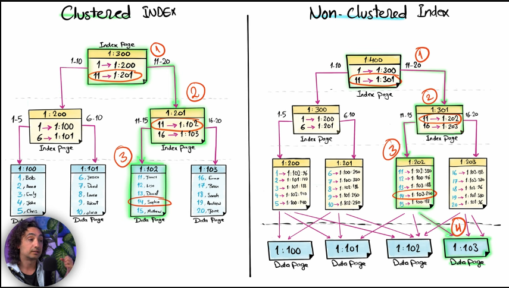
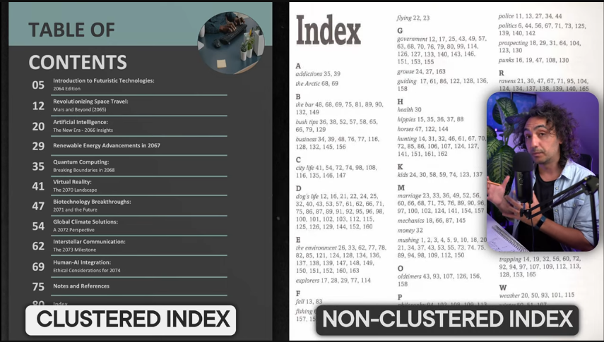

# Structured Query Language (SQL)

[](https://www.geeksforgeeks.org/dbms/acid-properties-in-dbms/)

# [SQL Execution Plans](https://www.youtube.com/watch?v=O7AzUDogXsw)

<a href="https://bytebytego.com/guides/visualizing-a-sql-query/">
    
</a>


<a href="https://www.youtube.com/watch?v=BxAj3bl00-o&list=PLNcg_FV9n7qZY_2eAtUzEUulNjTJREhQe&index=33">
    
    
</a>
<a href="https://sqlbak.com/academy/database-page/">
    
</a>


## 1. Rowstore Heap (just the name is heap, nothing like heap)

A heap is a collection of data pages with no logical ordering. Pages are not linked in sorted order, but are connected via the IAM (Index Allocation Map).

**Data Page Diagram:**
```
+--------------------------------------------------------------------------------------+
|                            Page Header (Page #, # of rows, etc.)                     |
+---------------------------------------------+----------------------------------------+
|                 Slot Array (Offset List)    |               Data Rows                |
| [Slot 0] -> Offset to Row 4                 | +------------------------------------+ |
| [Slot 1] -> Offset to Row 1                 | | Row 4: (OrderID:103, CustID:55,...)| |
| [Slot 2] -> Offset to Row 2                 | +------------------------------------+ |
| [Slot 3] -> Offset to Row 3                 | | Row 1: (OrderID:101, CustID:12,...)| |
|                                             | +------------------------------------+ |
|                                             | | Row 2: (OrderID:102, CustID:88,...)| |
|                                             | +------------------------------------+ |
|                                             | | Row 3: (OrderID:100, CustID:33,...)| |
|                                             | +------------------------------------+ |
+---------------------------------------------+----------------------------------------+
```
**Key Characteristics:**
*   **No Ordering:** Rows are stored in the order they were inserted. The slot array at the page bottom provides the logical order for scanning.
*   **Page Links:** Pages are not linked to each other in order. The database uses an IAM page to find all pages belonging to the heap.
*   **Forwarding Pointers:** If a row is updated and can't fit on the original page, it's moved to a new page, and a forwarding pointer is left in its place.

---

## 2. Rowstore Clustered Index

The data pages themselves are the leaf level of the B+ tree and are stored in sorted order. Pages are doubly-linked for efficient range scans.


**Data Page (Leaf Level) Diagram:**
```
+-----------------------------------------------------------------------------------------+
|                         Page Header                                                     |
+---------+-------------------------------------------------------------------------------+
| PrevPage|                             Data Rows (Physically Sorted)                     |
| Pointer | +-----------------------------------------------------------------------+     |
|    |    | | Row 100: (OrderID:100, CustID:33, ...)                                |     |
|    v    | +-----------------------------------------------------------------------+     |
+---------+ | Row 101: (OrderID:101, CustID:12, ...)                                |     |
| NextPage| +-----------------------------------------------------------------------+     |
| Pointer | | Row 102: (OrderID:102, CustID:88, ...)                                |     |
|    |    | +-----------------------------------------------------------------------+     |
|    v    | | Row 103: (OrderID:103, CustID:55, ...)                                |     |
+---------+ +-----------------------------------------------------------------------+     |
```
**Key Characteristics:**
*   **Sorted Data:** Rows are physically stored on the page in the order of the clustered index key (e.g., `OrderID`).
*   **Doubly-Linked Pages:** Each page has pointers to the *next* and *previous* page in logical key order. This makes range scans (`BETWEEN`, `>`, `<`) extremely efficient.

---

## 3. Rowstore Non-Clustered Index

The leaf pages of a non-clustered index contain the index key columns and a pointer (a Row ID or the Clustered Index Key) back to the full data row.

**Data Page (Leaf Level) Diagram:**
```+=======================================================================================+
|                                    Page Header                                        |
| (Page Type: INDEX, Index ID: YourIndexID, Level: 0, Pointer to next/prev page, etc.) |
+===========================================+===========================================+
|            Slot Array                     |            Index Rows (Sorted)            |
| (Logical order -> Physical offsets)       |                                           |
|                                           | +-------------------------------------+   |
| Slot 0: → Offset of Row 1                 | | CustomerID: 100 | OrderDate: 2023-10-01 | → OrderID: 507 |
|                                           | +-------------------------------------+   |
| Slot 1: → Offset of Row 2                 | | CustomerID: 100 | OrderDate: 2023-10-05 | → OrderID: 281 |
|                                           | +-------------------------------------+   |
| Slot 2: → Offset of Row 3                 | | CustomerID: 101 | OrderDate: 2023-10-02 | → OrderID: 912 |
|                                           | +-------------------------------------+   |
| Slot 3: → Offset of Row 4                 | | CustomerID: 102 | OrderDate: 2023-10-03 | → OrderID: 103 |
|                                           | +-------------------------------------+   |
| ...                                       | | ...                                 |   |
|                                           | +-------------------------------------+   |
+===========================================+===========================================+
```
**Key Characteristics:**
*   **Sorted Index Keys:** The index keys(**only selected columns**) are stored in sorted order, but the actual data rows are not.
*   **The Pointer:**
    *   If the base table is a **heap**, the pointer is a **Row ID (RID)** – a direct physical address (File #:Page #:Slot #).
    *   If the base table has a **clustered index**, the pointer is the **Clustered Index Key** of that row. This is why having a narrow clustered key is important. **If it stored a direct physical pointer, every time the data row moved (which happens frequently), every single non-clustered index on the table would need to be updated**. This would be catastrophically expensive.

---

## 4. Columnstore Clustered Index

This is the physical structure of the entire table. Data is grouped into rowgroups, and each column is compressed and stored separately.

### NOTE - When a row group is compressed (either by a bulk load operation or the Tuple Mover process), it takes a *set of complete rows* and processes them. Hence, all of the column data sections in a row group will contain same amount of rows. ofcource that means that let's say column1 data section is very big compare to column2 data section in a particular LOB(large object) page.

**Overall Structure Diagram:**
```
           COLUMNSTORE TABLE: "Orders"
+-------------------------------------------------------+
|                  RowGroup 1 (~1M rows)                |
| +-----------------+ +-----------------+ +------------+|
| | OrderID Column  | |  CustID Column  | | Amt Column ||
| | Segment         | | Segment         | | Segment    ||
| | (Compressed)    | | (Compressed)    | | (Compressed||
| +-----------------+ +-----------------+ +------------+|
+-------------------------------------------------------+
|                  RowGroup 2 (~1M rows)                |
| +-----------------+ +-----------------+ +------------+|
| | OrderID Column  | |  CustID Column  | | Amt Column ||
| | Segment         | | Segment         | | Segment    ||
| | (Compressed)    | | (Compressed)    | | (Compressed||
| +-----------------+ +-----------------+ +------------+|
+-------------------------------------------------------+
```
**Inside a Column Segment:**
The segment metadata is crucial for performance.
```
+----------------------------------------------------------------+
|                   Column Segment (e.g., Amt Column)            |
+---------+-----------+-------------+-----------+----------------+
| Segment | Dictionary| Value       | Bitpacked | NULL /         |
| Header  | (for      | Compression | Data      | Run-Length     |
| (Min val,| low-card | (e.g.,      |           | Encoding       |
| Max val,| columns)  | 10, 20, 30) |           |                |
| # values)|          |             |           |                |
+---------+-----------+-------------+-----------+----------------+
```
**Key Characteristics:**
*   **RowGroups:** The fundamental unit of storage. Each is a clustered index "page" containing ~1M rows.
*   **Column Segments:** Each column within a rowgroup is compressed into a segment using the most efficient encoding (dictionary, value, bitpacking, RLE).
*   **Metadata:** Each segment has a header storing the min and max values. This allows the query engine to quickly skip entire segments that don't contain relevant data (**segment elimination**).

---

## 5. Columnstore Non-Clustered Index

This is a secondary columnstore structure built on top of a traditional rowstore table. The data exists in two complete, separate formats. No link between these 2. you have to run same query on both seperatly.

**Overall Structure Diagram:**
```
         BASE ROWSTORE TABLE (Heap or CI)        COLUMNSTORE NONCLUSTERED INDEX (Copy)
+---------------------------------------------+  +---------------------------------------+
| [Page 1]: (OrderID:101, CustID:12, Amt:$20) |  |         RowGroup 1                    |
| [Page 1]: (OrderID:103, CustID:55, Amt:$75) |  | +-------------+ +-------------+      |
| [Page 2]: (OrderID:100, CustID:33, Amt:$10) |  | | OrderID Seg.| | CustID Seg. | ...  |
| [Page 2]: (OrderID:102, CustID:88, Amt:$50) |  | | (Compressed)| | (Compressed)|      |
+---------------------------------------------+  | +-------------+ +-------------+      |
                                                 +---------------------------------------+


+=======================================================================================+
|                                    Page Header                                        |
| (Page Type: COLUMNSTORE, Object ID, Column ID, Segment Metadata, etc.)               |
+===========================================+===========================================+
|                 Metadata Section          |               Data Section                |
|                                           |                                           |
| - Segment ID                              |  +-------------------------------------+  |
| - Row Count (e.g., 1000 rows)             |  |  Column 1 Value Dictionary          |  |
| - Min Value (Col1)                        |  |  [ValueID -> Actual Value]          |  |
| - Max Value (Col1)                        |  |  0 -> "Type A"                      |  |
| - Min Value (Col2)                        |  |  1 -> "Type B"                      |  |
| - Max Value (Col2)                        |  |  2 -> "Type C"                      |  |
| - Encoding Type                           |  +-------------------------------------+  |
| - Compression Information                 |                                           |
|                                           |  +-------------------------------------+  |
|                                           |  |  Column 2 Value Dictionary          |  |
|                                           |  |  [ValueID -> Actual Value]          |  |
|                                           |  |  0 -> 100                           |  |
|                                           |  |  1 -> 200                           |  |
|                                           |  |  2 -> 300                           |  |
|                                           |  +-------------------------------------+  |
|                                           |                                           |
|                                           |  +-------------------------------------+  |
|                                           |  |  Column 1 Data (Compressed)         |  |
|                                           |  |  [Row1: ValueID, Row2: ValueID, ...]|  |
|                                           |  |  0,1,0,2,1,0,1,2,...               |  |
|                                           |  +-------------------------------------+  |
|                                           |                                           |
|                                           |  +-------------------------------------+  |
|                                           |  |  Column 2 Data (Compressed)         |  |
|                                           |  |  [Row1: ValueID, Row2: ValueID, ...]|  |
|                                           |  |  1,0,2,1,0,2,1,0,...               |  |
|                                           |  +-------------------------------------+  |
|                                           |                                           |
|                                           |  +-------------------------------------+  |
|                                           |  |  Row Group Metadata                 |  |
|                                           |  |  - Row IDs mapping                 |  |
|                                           |  |  - Deleted rows bitmap             |  |
|                                           |  +-------------------------------------+  |
+===========================================+===========================================+
```
**Key Characteristics:**
* **No Direct Pointers: Unlike rowstore indexes, columnstore doesn't store direct pointers to rows. Instead, it uses row group metadata and positional information.**
*   **Dual Storage:** The data is stored **twice**. The base rowstore table handles transactional operations (single-row `INSERT`/`UPDATE`/`DELETE`).
*   **Delayed Propagation:** Changes to the rowstore table are tracked and asynchronously propagated to the columnstore index, often via a "delta store" which is a separate rowstore structure that holds recent changes. The tuple mover process eventually **compresses this delta store** into the main columnstore rowgroups.
*   **Query Routing:** An analytical query will read from the columnstore index. A transactional query (e.g., `SELECT * FROM table WHERE ID = 123`) will read from the base rowstore table. The optimizer chooses the best source.
### Time Complexity Comparison

| Operation | Columnstore Clustered Index | Columnstore Non-Clustered Index | Explanation & Rationale |
| :--- | :--- | :--- | :--- |
| **Insert Single Row** | **O(1)** amortized (to Delta Store) | **O(1)** amortized (to Delta Store) | Inserts are not applied directly to the compressed Row Groups. They are buffered in a separate, rowstore-based **Delta Store**. This is a simple append operation, making it very fast. |
| | **O(n)** (on Tuple Mover merge) | **O(n)** (on Tuple Mover merge) | Eventually, the background **Tuple Mover** process compresses the Delta Store into the main columnstore. This is an expensive bulk operation proportional to the size of the delta store. |
| **Update Key Column** | **O(n)** (Logical Delete + Insert) | **O(n)** (Logical Delete + Insert) | An update on a **key** column is implemented as a **DELETE followed by an INSERT**. The delete is a logical mark in the Delete Bitmap. The insert goes to the Delta Store. The cost is dominated by finding the row(s) to mark for deletion. |
| **Update Non-Key Column** | **O(n)** (Logical Delete + Insert) | **O(n)** (Logical Delete + Insert) | **Same as above.** In a columnstore, there is no direct "update in place" for any column. *Any* modification is handled as a delete+insert, regardless of whether the column is a key or not. This is a major architectural difference from rowstore. |
| **Delete Single Row** | **O(n)** | **O(n)** | The row must be found first. Once found, it is not physically removed. Instead, its ID is **marked in a "Delete Bitmap"**, logically marking it as deleted. The cost is in the search to find the row ID. |
| **Range Scan / Aggregate** | **O(k)** (where k is # of *segments* scanned) | **O(k)** (where k is # of *segments* scanned) | This is where columnstore shines. It uses **segment elimination** (skipping segments using min/max metadata) and scans only compressed column data in parallel. Complexity is linear to the number of segments needed, not rows. |

---

### Key Concepts for Understanding the Complexities:

1.  **Delta Store:** A write-optimized, rowstore structure that acts as a staging area for new rows. This is why `INSERT` is fast (O(1)) until it needs to be merged.
2.  **Delete Bitmap:** A structure that tracks which rows in the compressed Row Groups have been logically deleted. This avoids the expensive operation of rewriting the entire compressed segment for a deletion.
3.  **Tuple Mover:** A background process that compresses the rows from the Delta Store into the main columnstore format (into new Row Groups). This is an expensive O(n) operation but happens asynchronously.
<br />
<br />
<br />

# Table 1: Time Complexity / Performance Characteristics

This table describes the general cost of operations for each structure, where `n` is the number of rows in the table.

| Operation | Rowstore Heap | Rowstore Clustered Index | Rowstore Non-Clustered Index | Columnstore Clustered Index | Columnstore Non-Clustered Index |
| :--- | :--- | :--- | :--- | :--- | :--- |
| **SELECT by Indexed Key** (Point Query) | `O(n)` (Full Table Scan) | `O(log n)` (B-Tree Seek) | `O(log n)` (Index Seek) + `O(1)`/`O(log n)` (Lookup)* | `O(n)` (Segment Scan) / `O(1)` if eliminated | `O(log n)` (Seek in columnstore) + Lookup to rowstore |
| **SELECT Range** (e.g., `BETWEEN`) | `O(n)` (Full Table Scan) | `O(log n + k)` (Seek + range scan) | `O(log n + k)` (Seek + range scan) + Lookup per row* | **`O(k)`** (Highly efficient column scan) | `O(k)` (Efficient column scan) + Lookup to rowstore |
| **SELECT Aggregate** (e.g., `SUM(column)`) | `O(n)` (Full Table Scan) | `O(n)` (Full Clustered Index Scan) | `O(n)` (Full Table Scan or Index Scan) | **`O(k)`** (k=# rowgroups, only reads one column) | `O(k)` (Reads from columnstore copy) |
| **INSERT** (Single Row) | `O(1)` (Append to heap) | `O(log n)` (Find insert position) | `O(log n)` (Update each NCI) + `O(log n)` for CI | `O(1)` (Goes to delta store) / `O(n)` on compression | `O(log n)` (to rowstore) + `O(1)` (to delta store for columnstore) |
| **UPDATE** (Key Column) | `O(n)` (Find row) + `O(1)` (Update) | `O(log n)` (Find row) + `O(log n)` (Potential move) + `O(log n)` (Update each NCI) | `O(log n)` (Find row) + `O(log n)` (Update NCI) + `O(log n)` (Update CI if key changes) | **Very Costly** (`DELETE` + `INSERT`) | **Very Costly** (Must update both rowstore and columnstore) |
| **UPDATE** (Non-Key Column) | `O(n)` (Find row) + `O(1)` (Update) | `O(log n)` (Find row) + `O(1)` (Update) + `O(log n)` (if column in NCI) | `O(log n)` (Find row) + `O(1)` (Update heap/CI) + `O(log n)` (Update NCI if column is in it) | **Very Costly** (Row must be re-written in columnstore) | **Costly** (Must update both rowstore and columnstore) |
| **DELETE** | `O(n)` (Find row) + `O(1)` (Mark space free) | `O(log n)` (Find row) + `O(log n)` (Remove from CI) + `O(log n)` (Remove from each NCI) | `O(log n)` (Find row) + `O(log n)` (Remove from CI) + `O(log n)` (Remove from each NCI) | **Very Costly** (Marking in columnstore is expensive) | **Costly** (Must delete from both rowstore and columnstore) |
| **FULL TABLE SCAN** | `O(n)` | `O(n)` | `O(n)` (Usually worse than heap/CI due to fragmentation) | **`O(n)` but much faster in practice** due to compression & columnar reads. |

***Key for `SELECT` in Rowstore Non-Clustered Index:**
*   **`O(1)` Lookup:** If the table is a heap, the lookup is a direct pointer (potentially `O(1)`).
*   **`O(log n)` Lookup:** If the table has a clustered index, the pointer in the non-clustered index is the clustered key. The database must then perform a `O(log n)` seek on the clustered index to find the full row. This is called a **Key Lookup** and can become very expensive if many rows are returned.

---

<br />
<br />

# Table 2: Space Complexity / Overhead

This table describes the relative storage overhead of each structure.

| Structure | Base Storage | Index-Specific Overhead | Notes |
| :--- | :--- | :--- | :--- |
| **Rowstore Heap** | `O(n)` | **None** | The baseline. No additional structures. |
| **Rowstore Clustered Index** | `O(n)` | `O(n)` | The table itself is the index. The B-tree structure has some overhead, but the data size is still linear. |
| **Rowstore Non-Clustered Index** | `O(n)` (for the heap or CI) | **`O(n * k)`** (for the NCI itself) | `k` is the size (number of columns) of the index key. Each NCI is a separate `O(n)` structure. Adding many NCIs significantly increases storage. |
| **Columnstore Clustered Index** | **`O(n / c)`** where `c` is the compression ratio. | **None** (It is the table) | **The major advantage.** The base storage is drastically reduced, often by **10x-15x**, due to columnar compression (values from the same column compress very well). |
| **Columnstore Non-Clustered Index** | `O(n)` (for the base rowstore table) | **`O(n / c)`** (for the columnstore index copy) | **The major disadvantage.** The data is stored **twice**: once in row format (`O(n)`) and once in a compressed column format (`O(n/c)`). This is a trade-off for hybrid transactional/analytical workloads. |

### Summary of Trade-offs

*   **Rowstore (Heap/CI/NCI):** Optimized for **operational** workloads (OLTP). Fast writes and point reads. Slows down on large analytical queries.
*   **Columnstore (Clustered):** Optimized for **analytical** workloads (OLAP). Extremely slow writes, incomprehensibly fast reads for aggregations and scans.
*   **Columnstore (Non-Clustered):** A **hybrid** solution. Sacrifices storage space and write performance to enable fast analytical queries on an operational table without a full migration to a data warehouse.