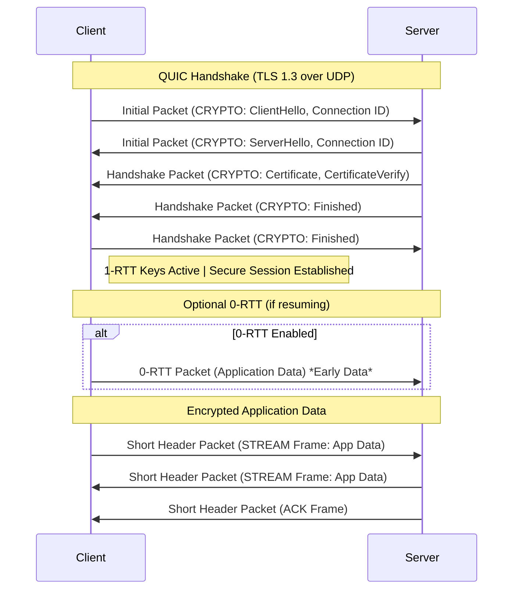

# HTTP (Hypertext Transfer Protocol)

It is an application-layer protocol that enables the transfer of hypertext (such as HTML) between clients (usually web browsers) and servers.


### **HTTP Request Structure**
1. **Request Line** – Method + URL + HTTP version.  
   ```http
   GET /index.html HTTP/1.1
   ```
2. **Headers** – Additional metadata (e.g., `Host`, `User-Agent`, `Accept`).  
   ```http
   Host: www.example.com
   User-Agent: Mozilla/5.0
   Accept: text/html
   ```
3. **Body (Optional)** – Used in `POST`, `PUT` requests (e.g., form data).

---

### **HTTP Response Structure**
1. **Status Line** – HTTP version + Status code + Status message.  
   ```http
   HTTP/1.1 200 OK
   ```
2. **Headers** – Metadata (e.g., `Content-Type`, `Server`, `Set-Cookie`).  
   ```http
   Content-Type: text/html
   Server: Apache
   ```
3. **Body (Optional)** – The actual data (e.g., HTML, JSON).  
   ```html
   <html><body>Welcome!</body></html>
   ```

### **HTTP Status Codes**
- `1xx` (Informational) – e.g., `100 Continue`  
- `2xx` (Success) – e.g., `200 OK`, `201 Created`  
- `3xx` (Redirection) – e.g., `301 Moved Permanently`, `304 Not Modified`  
- `4xx` (Client Error) – e.g., `404 Not Found`, `403 Forbidden`  
- `5xx` (Server Error) – e.g., `500 Internal Server Error`, `503 Service Unavailable`  

---
### **HTTP Methods** 

| **HTTP Method** | **Description**                                                                 |
|-----------------|-----------------------------------------------------------------------------|
| **GET**         | Retrieves a resource. Should not modify data.                               |
| **POST**        | Submits data to be processed (e.g., create a new resource).                |
| **PUT**         | Replaces a resource entirely or creates it if it doesn't exist.            |
| **PATCH**       | Partially updates a resource (applies only modifications). eg. if your resource is type json obj and you want modify 1 field, if it were a **put** req the whole obj would've changed.              |
| **DELETE**      | Deletes a specified resource.                                              |
| **HEAD**        | Similar to GET but retrieves only headers (no body).                       |
| **OPTIONS**     | Returns supported HTTP methods for a resource (used for CORS).             |
| **TRACE**       | Echoes the received request (used for debugging).                          |
| **CONNECT**     | Establishes a tunnel (e.g., for HTTPS via a proxy).                        |


---

### **QUIC Protocol**

[](https://engineeringatscale.substack.com/p/how-quic-is-displacing-tcp-for-speed)




# HTTP 1.1/2/3 + [QUIC](https://youtu.be/RIFnXaiRs_o?si=SaSRg2KNRNHS_rMH) (Quick UDP Internet Connections)

### My understanding
HTTP 1.1 creates multiple TCP connections for mulitple files, that's why it's slow because creating each TCP tunnel require 3 way handshake. HTTP 2 improves it by using only 1 TCP connection but with mulitple streams, i.e. each file is will have stream id to differentiate but the problem with that is if some ACK packet of some stream get loss during transmission, it will affect other stream as well because streamIDs are built on top of TCP segmentIDs, system don't know that other streams have been transmitted succesfully & only 1 stream is remaining. So TCP is bottle-neck here, in high loss environment even [HTTP 1.1 is faster](https://youtu.be/ai8cf0hZ9cQ?si=B-nOTkWACOiKclYk&t=269). This problem got solved in HTTP 2 over QUIC(developed by Google), tough it was never a standard(only experimental hybrid) for transition to HTTP 3(over QUIC). HTTP 2 still suffers from Stream Dependencies, if a high-priority stream is blocked, dependent streams must wait. It prioritize streams (e.g., CSS > images). HTTP 3 solves this problem completely.

### References

- [HTTP versions comparision](https://www.youtube.com/watch?v=ai8cf0hZ9cQ)
- [HTTP/2 Critical Limitation that led to HTTP/3 & QUIC](https://www.youtube.com/watch?v=GriONb4EfPY), [Another Video explaining same stuff](https://www.youtube.com/watch?v=beDiiWE8ESM)
- [Wikipedia - QUIC](https://en.wikipedia.org/wiki/QUIC)
---

### Comparison Table

| Feature               | **HTTP/1.1** | **HTTP/2 over TCP** | **HTTP/2 over QUIC** | **HTTP/3 (QUIC)** |
|----------------------|-------------|---------------------|----------------------|------------------|
| **Transport Protocol** | TCP         | TCP                 | QUIC (UDP-based)     | QUIC (UDP-based) |
| **Multiplexing**      | No (Head-of-Line blocking) | Yes (Streams) | Yes (Streams) | Yes (Streams) |
| **Header Compression** | No (Plain text headers) | HPACK | HPACK | QPACK (Improved HPACK) |
| **Security**          | Optional (HTTPS) | Mandatory (TLS) | Mandatory (TLS) | Built-in (TLS 1.3) |
| **Connection Setup** | TCP Handshake (1 RTT) | TCP + TLS (1-3 RTT) | QUIC (0-1 RTT) | QUIC (0-1 RTT) |
| **Head-of-Line (HoL) Blocking** | Yes (TCP-level) | Yes (TCP-level) | Reduced (QUIC handles packet loss per stream) | Eliminated (Independent streams) |
| **Error Recovery**    | TCP Retransmission | TCP Retransmission | QUIC (Per-stream retransmission) | QUIC (Faster recovery) |
| **Connection Migration**(Changing Wifi/IP) | No | No | Yes (Connection ID) | Yes (Connection ID) |
| **Server Push**       | No | Yes | Yes | Yes (but deprecated in favor of other optimizations) |
| **Latency**           | High (Multiple connections) | Lower (Multiplexing) | Lower (0-RTT support) | Lowest (0-RTT + no HoL blocking) |
| **Adoption**          | Universal | Widespread | Rare (Mostly experimental) | Growing (Replaces HTTP/2 over QUIC) |

- **HTTP/1.1**: Simple, but inefficient due to lack of multiplexing and HoL blocking.
- **HTTP/2 over TCP**: Improves performance with multiplexing but still suffers from TCP’s HoL blocking.
- **HTTP/2 over QUIC**: An experimental approach (not standardized), reducing HoL blocking but still using HTTP/2 semantics. Streams can depend on each other. If a high-priority stream is blocked, dependent streams must wait (e.g., CSS > images).
- **HTTP/3 (QUIC)**: The true successor, eliminating TCP entirely, reducing latency, and improving mobility & security.
   - Each stream is fully independent.
   - **QPACK (instead of HPACK)** – Allows headers to be sent out-of-order.
   - **QUIC handles all retransmissions per-stream** – No stalled streams due to packet loss.
