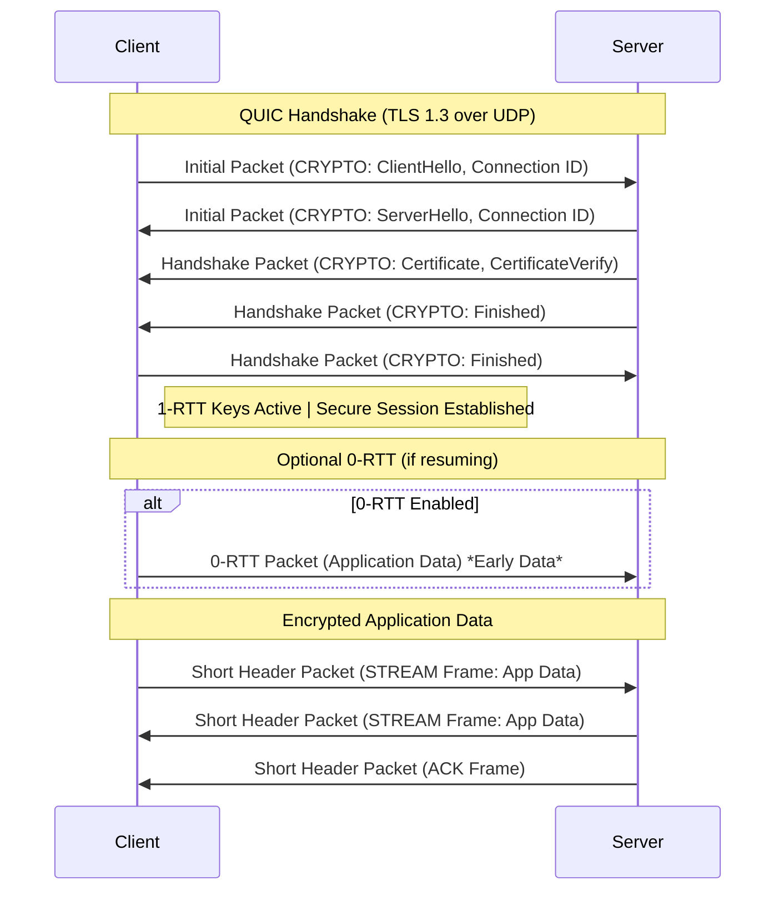

# HTTP (Hypertext Transfer Protocol)

It is an application-layer protocol that enables the transfer of hypertext (such as HTML) between clients (usually web browsers) and servers.


### **HTTP Request Structure**
1. **Request Line** – Method + URL + HTTP version.  
   ```http
   GET /index.html HTTP/1.1
   ```
2. **Headers** – Additional metadata (e.g., `Host`, `User-Agent`, `Accept`).  
   ```http
   Host: www.example.com
   User-Agent: Mozilla/5.0
   Accept: text/html
   ```
3. **Body (Optional)** – Used in `POST`, `PUT` requests (e.g., form data).

---

### **HTTP Response Structure**
1. **Status Line** – HTTP version + Status code + Status message.  
   ```http
   HTTP/1.1 200 OK
   ```
2. **Headers** – Metadata (e.g., `Content-Type`, `Server`, `Set-Cookie`).  
   ```http
   Content-Type: text/html
   Server: Apache
   ```
3. **Body (Optional)** – The actual data (e.g., HTML, JSON).  
   ```html
   <html><body>Welcome!</body></html>
   ```

### **HTTP Status Codes**
- `1xx` (Informational) – e.g., `100 Continue`  
- `2xx` (Success) – e.g., `200 OK`, `201 Created`  
- `3xx` (Redirection) – e.g., `301 Moved Permanently`, `304 Not Modified`  
- `4xx` (Client Error) – e.g., `404 Not Found`, `403 Forbidden`  
- `5xx` (Server Error) – e.g., `500 Internal Server Error`, `503 Service Unavailable`  

---
### **HTTP Methods** 

| **HTTP Method** | **Description**                                                                 |
|-----------------|-----------------------------------------------------------------------------|
| **GET**         | Retrieves a resource. Should not modify data.                               |
| **POST**        | Submits data to be processed (e.g., create a new resource).                |
| **PUT**         | Replaces a resource entirely or creates it if it doesn't exist.            |
| **PATCH**       | Partially updates a resource (applies only modifications). eg. if your resource is type json obj and you want modify 1 field, if it were a **put** req the whole obj would've changed.              |
| **DELETE**      | Deletes a specified resource.                                              |
| **HEAD**        | Similar to GET but retrieves only headers (no body).                       |
| **OPTIONS**     | Returns supported HTTP methods for a resource (used for CORS).             |
| **TRACE**       | Echoes the received request (used for debugging).                          |
| **CONNECT**     | Establishes a tunnel (e.g., for HTTPS via a proxy).                        |

---

## [HTTP Headers](https://beeceptor.com/docs/concepts/http-headers/)

```bash
curl https://aulas.in -I #to list all response headers
```

### 1. The "Must-Have" Security Headers (Response)
If you are running a production website, these are virtually required to protect your users from attacks like XSS (Cross-Site Scripting) and Clickjacking.

* **`Strict-Transport-Security` (HSTS):**
    * **Function:** Tells the browser, "Only talk to me over HTTPS. Never use HTTP."
    * **Why it matters:** Prevents protocol downgrade attacks and cookie hijacking.


* **`Content-Security-Policy` (CSP):**
    * **Function:** A whitelist of sources from which the browser is allowed to load resources (scripts, images, styles).
    * **Why it matters:** It is the strongest defense against XSS attacks. If a hacker injects a malicious script, the CSP will block it from running if the source isn't trusted. Only script from the mentioned source is allowed
```http
Content-Security-Policy: default-src 'self';
                         script-src 'self' https://apis.google.com;(javascript sources -- important)
                         style-src 'self' 'unsafe-inline';
                         img-src *;
                         font-src 'self' https://fonts.gstatic.com;
                         frame-ancestors 'none';
                         form-action 'self';
                         base-uri 'self';
```

* **[`X-Content-Type-Options: nosniff`](https://developer.mozilla.org/en-US/docs/Web/HTTP/Guides/MIME_types):**
[MIME sniffing](https://youtu.be/eq6R6dxRuiU?si=XVQVp90EzBYpVq0N) is the process by which a web browser inspects the content of a resource to guess its file type, rather than relying solely on the Content-Type header.If the browser doesn't trust the header or it's missing, it may perform MIME sniffing. This can be a security risk, as a malicious file could be disguised as a safe one, leading the browser to execute it as a dangerous type, such as promoting a text file to an executable file. To mitigate this risk, browsers can be configured to disable MIME sniffing or you can set the mentioned header.

    * **Function:** Prevents the browser from "guessing" (sniffing) the file type.
    * **Why it matters:** It forces the browser to trust the `Content-Type` header. Without this, a browser might execute a `.jpg` file as JavaScript if it detects code inside it.
* **`X-Frame-Options`:**
    * **Function:** Controls whether your site can be embedded in an `<iframe>` on another site.
    * **Why it matters:** Prevents "Clickjacking" attacks where invisible overlays trick users into clicking buttons on your site.

* **[`Referrer-Policy`](https://youtu.be/4bQeGUzHpOE?si=Wc2ed13J_JsqtYtz&t=252):** It tells a destination site the full URL of the page the user just came from. This can pose a privacy and security risk because the full URL might contain sensitive data.
   $$\text{Referrer-Policy: strict-origin-when-cross-origin}$$
   It will only send the top level domain if Cross-Origin, or no header sent if protocol downgrade(https -> http).

* **Permissions-Policy**: A privacy header that explicitly disables browser features you don't need. If your blog doesn't need the user's camera, microphone, or geolocation, turn them off so a hacked script can't access them.


### 2. Performance & Caching Headers
These headers determine how fast your site feels by controlling how long data stays on the user's device.

* **`Cache-Control`:**
    * **Function:** The master switch for caching. You can set directives like `max-age=3600` (cache for an hour) or `no-store` (never cache sensitive data).
    * **Importance:** Essential for reducing server load and speeding up page loads.
* **`ETag`:**
    * **Function:** A unique fingerprint (hash) of a specific version of a file.
    * **Importance:** Allows the browser to ask, "Has this file changed since I last downloaded it?" If the ETag matches, the server returns a `304 Not Modified` (saving bandwidth).
* **`Vary`:**
    * **Function:** Tells caches which request headers determine distinct cached versions (e.g., `Vary: Accept-Encoding` ensures a device that doesn't support gzip doesn't get a gzipped file).

### 3. Data Handling & Negotiation
These headers ensure the server and client speak the same language.

* **`Content-Type`:**
    * **Function:** Tells the recipient what the data is (e.g., `application/json`, `text/html`, `image/png`).
    * **Importance:** Without this, the browser or API client won't know how to render the data.
* **`Content-Length`:**
    * **Function:** The size of the message body in bytes.
    * **Importance:** Used for progress bars and to know when a download is complete.
* **`Accept` (Request only):**
    * **Function:** The client tells the server what kind of data it *wants* (e.g., "I want JSON").
* **`Authorization` (Request only, i.e. not in http response):**
    * **Function:** Holds credentials (like Bearer tokens or Basic Auth) to prove identity.

### 4. [CORS Headers (Cross-Origin Resource Sharing)](https://beeceptor.com/docs/concepts/cors/) (READ only protection)

> Same-Origin Policy (SOP) is browser only feature/limitation.


If you are building an API that is accessed by a frontend on a different domain, you **must** configure these.

* **`Access-Control-Allow-Origin`:** Specifies which domains are allowed to access your API resources.
* **`Access-Control-Allow-Methods`:** Specifies which HTTP methods (GET, POST, PUT, DELETE) are allowed.


| Feature | Simple Request | Preflighted Request |
| :--- | :--- | :--- |
| **When used** | Requests meeting all "simple" criteria. | Requests **not** meeting "simple" criteria. |
| **Browser action** | Sends the actual request directly. | Sends an `OPTIONS` preflight request first, then the actual request if allowed. |
| **HTTP Methods** | Only `GET`, `HEAD`, `POST`. | Any other method (e.g., `PUT`, `DELETE`, `PATCH`). |
| **Allowed Headers** | Only CORS-safelisted headers (e.g., `Accept`, `Content-Language`). | Includes any custom headers (e.g., `Authorization`, `X-API-Key`). |
| **Content-Type** | Only `application/x-www-form-urlencoded`, `multipart/form-data`, or `text/plain`. | Any other value (e.g., `application/json`). |
| **Performance Note** | N/A | Caching the preflight response with `Access-Control-Max-Age` is recommended to reduce overhead. |

[  ](https://developer.mozilla.org/en-US/docs/Web/HTTP/Guides/CORS)

- **[Simple Request](https://www.youtube.com/watch?v=E6jgEtj-UjI)**: The browser sends the request immediately, without checking with the server first. It relies on the server's response headers (Access-Control-Allow-Origin) to decide if the response should be delivered to the requesting JavaScript code. If the server doesn't send the right header, the request still reaches the server and might change data, but the browser blocks the JavaScript from reading the response.


When the CORS standard was created, many existing web forms (like login or contact forms) used cross-origin `POST` with `Content-Type: application/x-www-form-urlencoded`. Making all these require a preflight would have broken the web overnight.

> **NOTE: CORS is NOT a defense against CSRF.** CORS only protects against unauthorized **READING** of the response by JavaScript.

**A CORS Protection Case**: Malicious JavaScript on `https://evil-site.com` tries to use `fetch()` to `GET` your transaction history from `https://bank.com/api/transactions` and read the result. The browser sends the request with your cookies, but the bank's API either **a)** doesn't send the `Access-Control-Allow-Origin: https://evil-site.com` header, or **b)** sends `Access-Control-Allow-Origin: *` (which is still safe if the API data is public). In either case, the browser blocks the malicious site's JavaScript from *reading* the response, protecting your data.

---

### Practically Required for Modern Web Development

While the server won't crash without these, your application likely will not work correctly or securely without them:

1.  **`Content-Type`:** (If sending data, generally managed by NestJS or other frameworks automatically) Required so the receiver knows how to read the body.
2.  **`Content-Length`:** (Usually set automatically) Required for keep-alive connections so the browser knows where one request ends and the next begins.
3.  **`Date`:** (Response) Required by the spec for responses containing a payload, though most modern servers add this automatically.

---


<br/>
<br/>
<br/>

### **QUIC Protocol**

[](https://engineeringatscale.substack.com/p/how-quic-is-displacing-tcp-for-speed)




# HTTP 1.1/2/3 + [QUIC](https://youtu.be/RIFnXaiRs_o?si=SaSRg2KNRNHS_rMH) (Quick UDP Internet Connections)

### My understanding
HTTP 1.1 creates multiple TCP connections for mulitple files, that's why it's slow because creating each TCP tunnel require 3 way handshake. HTTP 2 improves it by using only 1 TCP connection but with mulitple streams, i.e. each file is will have stream id to differentiate but the problem with that is if some ACK packet of some stream get loss during transmission, it will affect other stream as well because streamIDs are built on top of TCP segmentIDs, system don't know that other streams have been transmitted succesfully & only 1 stream is remaining. So TCP is bottle-neck here, in high loss environment even [HTTP 1.1 is faster](https://youtu.be/ai8cf0hZ9cQ?si=B-nOTkWACOiKclYk&t=269). This problem got solved in HTTP 2 over QUIC(developed by Google), tough it was never a standard(only experimental hybrid) for transition to HTTP 3(over QUIC). HTTP 2 still suffers from Stream Dependencies, if a high-priority stream is blocked, dependent streams must wait. It prioritize streams (e.g., CSS > images). HTTP 3 solves this problem completely.

### References

- [HTTP versions comparision](https://www.youtube.com/watch?v=ai8cf0hZ9cQ)
- [HTTP/2 Critical Limitation that led to HTTP/3 & QUIC](https://www.youtube.com/watch?v=GriONb4EfPY), [Another Video explaining same stuff](https://www.youtube.com/watch?v=beDiiWE8ESM)
- [Wikipedia - QUIC](https://en.wikipedia.org/wiki/QUIC)
---

### Comparison Table

| Feature               | **HTTP/1.1** | **HTTP/2 over TCP** | **HTTP/2 over QUIC** | **HTTP/3 (QUIC)** |
|----------------------|-------------|---------------------|----------------------|------------------|
| **Transport Protocol** | TCP         | TCP                 | QUIC (UDP-based)     | QUIC (UDP-based) |
| **Multiplexing**      | No (Head-of-Line blocking) | Yes (Streams) | Yes (Streams) | Yes (Streams) |
| **Header Compression** | No (Plain text headers) | HPACK | HPACK | QPACK (Improved HPACK) |
| **Security**          | Optional (HTTPS) | Mandatory (TLS) | Mandatory (TLS) | Built-in (TLS 1.3) |
| **Connection Setup** | TCP Handshake (1 RTT) | TCP + TLS (1-3 RTT) | QUIC (0-1 RTT) | QUIC (0-1 RTT) |
| **Head-of-Line (HoL) Blocking** | Yes (TCP-level) | Yes (TCP-level) | Reduced (QUIC handles packet loss per stream) | Eliminated (Independent streams) |
| **Error Recovery**    | TCP Retransmission | TCP Retransmission | QUIC (Per-stream retransmission) | QUIC (Faster recovery) |
| **Connection Migration**(Changing Wifi/IP) | No | No | Yes (Connection ID) | Yes (Connection ID) |
| **Server Push**       | No | Yes | Yes | Yes (but deprecated in favor of other optimizations) |
| **Latency**           | High (Multiple connections) | Lower (Multiplexing) | Lower (0-RTT support) | Lowest (0-RTT + no HoL blocking) |
| **Adoption**          | Universal | Widespread | Rare (Mostly experimental) | Growing (Replaces HTTP/2 over QUIC) |

- **HTTP/1.1**: Simple, but inefficient due to lack of multiplexing and HoL blocking.
- **HTTP/2 over TCP**: Improves performance with multiplexing but still suffers from TCP’s HoL blocking.
- **HTTP/2 over QUIC**: An experimental approach (not standardized), reducing HoL blocking but still using HTTP/2 semantics. Streams can depend on each other. If a high-priority stream is blocked, dependent streams must wait (e.g., CSS > images).
- **HTTP/3 (QUIC)**: The true successor, eliminating TCP entirely, reducing latency, and improving mobility & security.
   - Each stream is fully independent.
   - **QPACK (instead of HPACK)** – Allows headers to be sent out-of-order.
   - **QUIC handles all retransmissions per-stream** – No stalled streams due to packet loss.
