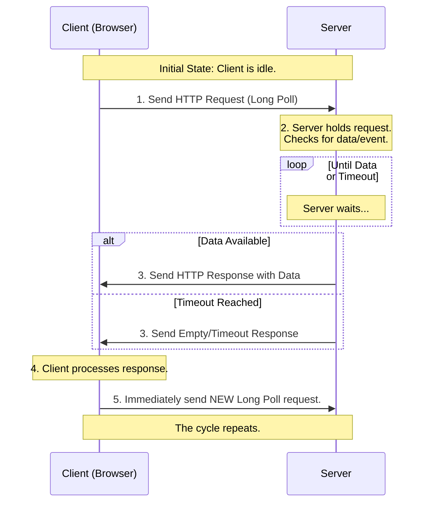

# Real-Time Communication (RTC)
It describes any method or technology that enables the immediate or near-instantaneous exchange of data between a client (like a web browser) and a server.

However, to be more precise, we can break it down further. The core concept that differentiates these methods is called **Client-Server Communication Patterns** or **Data Synchronization Strategies**.

The fundamental difference lies in **who initiates the request for data**:

1.  **Client Pull (The client asks for data)**
2.  **Server Push (The server sends data without being asked)**


Excellent question! The terms you're asking about fall under a few key concepts in computer science and web development. The most general and accurate umbrella term is:

### **Real-Time Communication (RTC)**

This is the broadest category. It describes any method or technology that enables the immediate or near-instantaneous exchange of data between a client (like a web browser) and a server.

However, to be more precise, we can break it down further. The core concept that differentiates these methods is called **Client-Server Communication Patterns** or **Data Synchronization Strategies**.

The fundamental difference lies in **who initiates the request for data**:

1.  **Client Pull (The client asks for data)**
2.  **Server Push (The server sends data without being asked)**

---

### 1. Client-Pull Methods (The Client Does the Work)

In these patterns, the client is responsible for checking if new data is available.

*   **Polling (Short Polling):** This is the simplest "pull" method.
    *   **How it works:** The client repeatedly sends HTTP requests to the server at regular intervals (e.g., every 5 seconds) asking, "Do you have any new data for me?"
    *   **Analogy:** Like a kid in the backseat asking "Are we there yet?" every minute.
    *   **Technical Term:** It's a specific type of **Client-Pull** strategy.

*   **Long Polling:** A more efficient variant of polling.
    *   **How it works:** The client sends a request, but the server holds it open until it has new data or a timeout occurs. Once the client gets a response, it immediately sends a new request. If no data becomes available after a predetermined time (e.g., 30 seconds), the server sends an empty response or a "timeout" signal.
    *   **Analogy:** The kid asks "Are we there yet?" and the parent says, "I'll tell you when we are," and only then does the kid ask again.
    *   **Technical Term:** This is also a **Client-Pull** strategy, but it's designed to emulate a **Server-Push**.
    * **Disadvantages:** 
        1. The constant opening and closing of HTTP connections has more overhead than a single, persistent WebSocket connection.
        2. If not Asynchronous architecture - It's not the socket connection itself that's expensive, but the thread blocking.



---

### 2. Server-Push Methods (The Server Takes Initiative)

In these patterns, the server can send data to the client as soon as it's available, without the client asking first. This is the foundation of true real-time functionality.

**Transport: exactly the same HTTP/TCP connection, just with different framing rules for messages.**

*   **[WebSockets](../Networking/WebSockets.md):** A full-duplex, persistent communication channel over a single TCP connection. For QUIC, the equivalent is **[WebTransport](https://youtu.be/ReV31oGX6oo?si=hdQ00tuvA3DxDE2p&t=971)**
    *   **How it works:** After an initial "handshake" (using an HTTP request), a persistent connection is established. Both the client and server can then send messages to each other at any time, independently.
    *   **Analogy:** A continuous telephone call where either person can speak at any time.
    *   **Technical Term:** This is a pure **Server-Push** technology and a specific **protocol** (``ws://`` or ``wss://``).

*   **[Server-Sent Events (SSE)](https://kennethnnalue.medium.com/introduction-to-server-sent-events-sse-d0b7590503a5):** A simpler, one-way server-push technology.
    *   **How it works:** The client opens a persistent connection to the server. The server can then send a stream of data (events) to the client over this connection, but the client cannot send data back over the same channel (it would use a normal HTTP request for that). Also has **auto-reconnect** feature.
    *   **Analogy:** A news feed or a stock ticker that automatically updates on your screen.
    *   **Technical Term:** This is a **Server-Push** technology and a specific web API.
    * In HTTP/3 (QUIC), the equivalent of SSE is possible because you can stream response bodies over QUIC streams.

    However, standard SSE is not widely implemented on HTTP/3 yet — browsers today usually still use HTTP/1.1 or 2 for SSE.

---

### 3. The Special Case: Webhooks

Webhooks are a bit different because they are typically used for **server-to-server** communication, not directly for client-to-server (like a web browser).

*   **Webhooks:** A method for one application to provide other applications with real-time information.
    *   **How it works:** You register a URL (from your application) with another service. When an event happens in that service (e.g., a new payment, a code push), it sends an HTTP POST request (a "webhook") to your registered URL with the event data.
    *   **Analogy:** Giving your phone number to a bakery and asking them to text you when your custom cake is ready, instead of you calling them every hour to check.
    *   **Technical Term:** This is a **Reverse API** or an **Event-Driven Callback**. It's a form of **asynchronous server-to-server communication**.


* **Security Concerns**
    Because Webhooks expose a public endpoint, they must be secured:

    * **Validation of sender**:
        * Shared secret → HMAC signature in header (`X-Signature`).
        * Consumer recalculates to verify.
    * **Use HTTPS** (TLS) to prevent sniffing or tampering.
    * **Rate limiting** and replay protection.
    * **Whitelist IP ranges** (when provider publishes them).

* **Retries & Reliability**
    * If the receiver is **down** or responds with non-200, producer retries.
    * Retry policy varies: exponential backoff, fixed intervals, max retry count.
    * Some providers give **dead-letter queues** (failed events stored for manual replay).

* **Common Use Cases**
    - Payments (PayPal, Stripe, Razorpay) → notify your app when transaction status changes.
    - Messaging/Chat (Slack, Discord) → notify apps of new messages/events.
    - CI/CD (GitHub, GitLab, Bitbucket) → trigger builds/deployments when code changes.
    - E-commerce → order created, order shipped events.
    - Monitoring/Alerts → notify third-party services on thresholds.

### Summary Table

### EVERY TCP CONNECTION/SOCKET IS BIDIRECTIONAL BUT IN BELOW TABLE It’s a logical direction at the application level, not a limitation of TCP. HTTP is unidirectional.

```
HTTP is not a piece of software with a single source code base—it’s a protocol specification defined in documents called RFCs (e.g. RFC 9110 for HTTP/1.1 and RFC 9113 for HTTP/2). The implementations of HTTP are written in many programming languages, because every OS, library, and framework needs to "speak HTTP". 
eg - 
C → Apache HTTP Server, Nginx, libcurl
C++ → Boost.Beast (C++ HTTP library)
Node.js (C++ + JS) → Node’s HTTP module

HTTP is implemented in many languages, but the unidirectional logic is visible in server code where it always waits for read_request() before send_response().
```


| Method | Who Initiates? | Communication Direction | Primary Use Case | Key Term |
| :--- | :--- | :--- | :--- | :--- |
| **Polling** | Client | Client → Server | Simple, compatible updates | **Client-Pull** |
| **Long Polling** | Client | Client → Server | More efficient than polling | **Client-Pull** |
| **WebSockets** | Either | Client ↔ Server (Bidirectional) | Chat, games, collaborative apps | **Server-Push**, **Protocol** |
| **Server-Sent Events** | Server | Server → Client (One-way) | Live feeds, notifications | **Server-Push** |
| **Webhooks** | Server (of Service A) | Server A → Server B (One-way) | Server-to-server notifications | **Reverse API**, **Callback** |

---
<br />
<br />
<br />


# Peer-to-Peer

## Torrent - todo

## [Web Real-Time Communication(WebRTC)](https://youtu.be/p2HzZkd2A40?si=HGCMi46L_rJ5t_Qb&t=1119)
```
WebRTC is an absolute pain to get right and even the best implementations still suffer connection losses. It truly is a niche solution.

Even discord Discord had to Build its Own "Custom" WebRTC

In interviews, I've seen more candidates go wildly off trail trying to design peer-to-peer systems using WebRTC than I have seen them successfully implement them. Most problems don't require peer-to-peer connections and it's easy to try to wrap a solution around a problem that doesn't actually need it.
If you stick to only using WebRTC for video/audio calling and conferencing, you'll be in good shape.
```

[](https://webrtc-security.github.io/)

* [WebRTC](https://youtu.be/FExZvpVvYxA?si=IaVpuadkyvLlKdhg&t=722) is a set of APIs and protocols for **peer-to-peer (P2P) communication** between browsers (or apps).
* Primary goal: enable **low-latency audio, video, and data streaming** directly between clients.
* Used in video calls, conferencing, P2P file sharing, gaming.
* WebRTC usually runs on **UDP** (for low latency), but can fall back to TCP if necessary.

### 🔧 Key JavaScript APIs
The WebRTC API is centered around a few critical interfaces:
*   `RTCPeerConnection`: The core object that manages the stable and efficient connection to a remote peer, handling ICE, STUN/TURN, and media flow.
*   `RTCDataChannel`: Provides a bi-directional channel for exchanging arbitrary data with low latency, useful for chat, file transfer, or game state.
*   `MediaStream` (`getUserMedia`): Provides access to the user's camera and microphone, representing a stream of audio and/or video tracks.


```
 WebRTC API (JS)
 ───────────────────────────────
 RTP / RTCP (media transport)    → handles video/audio streams
 SCTP (data channel)             → reliable/unreliable messages
 DTLS (encryption & keys)        → TLS handshake over UDP
 ICE (NAT traversal, candidate selection)
 STUN / TURN (signaling helpers)
 UDP (main transport), with TCP/TLS fallback if needed
```

### **How Peers Connect**

Establishing a direct peer-to-peer connection is a multi-step process involving several protocols to overcome network obstacles like firewalls and NATs.

*   **NAT Traversal**: To connect devices behind routers (NATs), WebRTC uses:
    *   **STUN (Session Traversal Utilities for NAT)**: A simple server that a client uses to discover its public IP address and port. This allows direct connections when possible (e.g., with "Full Cone" NATs).
    *   **TURN (Traversal Using Relays around NAT)**: A relay server used when a direct P2P connection is impossible (e.g., due to "Symmetric NAT" restrictions). It forwards data, consuming more bandwidth but ensuring connectivity.

*   **Signaling**: Before media can flow, peers must exchange session information. This is done via a **signaling server** (using WebSockets, XHR, etc.), which is not part of the WebRTC standard but is essential for coordinating the connection. The information exchanged includes:
    *   **Session Description Protocol (SDP)**: A text-based metadata format describing the media capabilities (codecs, resolutions) and network information of a peer. Offers and answers are exchanged to agree on session parameters.
    *   **Interactive Connectivity Establishment (ICE)**: A framework to find the best possible path for the peer-to-peer connection.
    *   **ICE Candidates**: Network addresses (private, public, relay) discovered by the ICE agent and exchanged via the signaling server.

*   **Media & Data Transport**: Once connected, the actual media streams are delivered using:
    *   **RTP (Real-time Transport Protocol)**: The standard for delivering audio and video over IP networks.
    *   **SRTP (Secure RTP)**: The encrypted version of RTP, which WebRTC mandates for security.
    *   **SCTP (Stream Control Transmission Protocol)**: Used by the `RTCDataChannel` for reliable or unreliable, low-latency data exchange.

    * WebRTC has built-in codec negotiation (SDP/offer-answer).
    * Clients automatically agree on H.264/VP8/Opus/etc. Without WebRTC, you’d have to reinvent this whole layer.

| **[Architecture](https://youtu.be/V8dIDXTF5Vo?si=A3Ruq-gf8u7geuGR&t=293)** | **How It Works** | **Pros & Cons** |
| :--- | :--- | :--- |
| **Peer-to-Peer (P2P)** | Direct connection between two browsers | **Pros:** Simple, low cost, end-to-end secure.<br>**Cons:** Doesn't scale; N participants require N-1 outgoing streams per client. |
| **Selective Forwarding Unit (SFU)** - Important(not p2p, discord voice channels) | Central server receives streams and selectively forwards them to other participants | **Pros:** Scales well; client sends one stream, receives many; leverages simulcast/SVC.<br>**Cons:** Higher client download bandwidth; doesn't support server-side recording well. |
| **Multipoint Conferencing Unit (MCU)** (not p2p)| Central server decodes all streams, composites them into a single video mix, and re-encodes it | **Pros:** Low client-side burden; consistent with legacy systems.<br>**Cons:** High server load; higher latency; quality loss from re-encoding. |


## The Core Problem: Why We Need NAT Traversal

Imagine two people behind their own home/office networks wanting to establish a direct video call. Their devices (laptops, phones) have **private IP addresses** (like `192.168.1.10`). The internet only understands **public IP addresses**.

A **Network Address Translation (NAT)** device (your router) solves the IP shortage problem by letting multiple devices share one public IP. It acts as a gatekeeper:

*   **Outbound:** Your device (`192.168.1.10:50000`) sends a packet to a server. The NAT rewrites the source address to `(Public_IP: 60001)` and remembers this mapping.
*   **Inbound:** When a response comes back to `(Public_IP: 60001)`, the NAT checks its table and forwards it to `(192.168.1.10:50000)`.

**The problem for WebRTC:** For a direct peer-to-peer connection, each peer needs to send media *to* the other. But if you just send your private IP address (`192.168.1.10`), the other peer on a different network can't reach you. If you send your public IP, the NAT doesn't have a pre-existing mapping to forward the incoming packets to your device. The NAT will simply drop these unsolicited incoming connection attempts.

**This is the fundamental barrier that NAT Traversal techniques are designed to overcome.**

---

## The Solution: A Coordinated Attack with ICE, STUN, and TURN

WebRTC doesn't rely on a single trick. It uses a robust, layered framework called **ICE (Interactive Connectivity Establishment)** to find the best possible path between two peers.

ICE works by gathering all possible candidate addresses for a peer and then systematically testing them to see which pairs work.

#### Step 1: Gathering Candidates

Each peer collects a list of potential connection addresses ("candidates"):

1.  **Host Candidate:** The device's own physical or virtual network interface address (e.g., `192.168.1.10`). This only works if both devices are on the same local network.
2.  **Server Reflexive Candidate:** This is the **key to basic NAT Traversal**. The peer uses a **STUN server**.
    *   **How it works:** The peer sends a request to a public STUN server saying, "What's my public IP and port from your perspective?"
    *   The STUN server replies: "I see you coming from `(Public_IP: 65432)`."
    *   This `(Public_IP: 65432)` is the **Server Reflexive Candidate**. It's the public "hole" punched in the NAT for this specific session.
3.  **Relayed Candidate:** If direct connection (via Host or Reflexive) is impossible, a fallback is used. The peer contacts a **TURN server**.
    *   **How it works:** The peer asks the TURN server to allocate a public IP and port that will **relay** all its traffic.
    *   The resulting `(TURN_Server_IP: Port)` is the Relayed Candidate. All audio/video/data will be sent to this server, which will then forward it to the other peer. This is less efficient (higher latency, cost for the provider) but is a guaranteed fallback.

#### Step 2: Exchange and Connectivity Checks

1.  **Signaling:** The two peers use a separate, secure channel (like a WebSocket connection via your chat app's server) to exchange their lists of ICE candidates. **This signaling channel does not carry any media traffic.**
2.  **The Handshake:** Once the lists are exchanged, the ICE agents on each peer begin **connectivity checks**.
3.  **Systematic Testing:** Peer A takes a candidate from Peer B's list, and Peer B takes a candidate from Peer A's list. They then send STUN-binding requests to each possible candidate pair.
    *   Example Test: Peer A (`192.168.1.10`) tries to connect to Peer B's Reflexive Candidate `(B_Public_IP: 12345)`.

#### Step 3: Establishing a Connection (The "Hole Punch")

This is the magic moment. Let's see how it works for the most common case:

1.  Both peers have gathered their Reflexive Candidates via their respective STUN servers.
2.  They exchange these candidates via the signaling server.
3.  Peer A sends a STUN request *to* Peer B's public address `(B_Public_IP: 12345)`.
    *   This packet goes through Peer A's NAT, which creates a temporary pinhole: "I'll allow *return traffic* from `B_Public_IP:12345` back to Peer A."
4.  Simultaneously, Peer B sends a STUN request *to* Peer A's public address `(A_Public_IP: 65432)`.
    *   This packet goes through Peer B's NAT, creating a similar pinhole.
5.  **The Punch:** Each peer's outgoing request arrives at the other peer's NAT. Since the NAT sees a packet from an expected address (the one it just sent a request to), it allows it through and forwards it to the respective peer.
6.  **Success!** The STUN packets are received and acknowledged. The ICE agents now know that the **candidate pair `(A_Public_IP:65432, B_Public_IP:12345)` is valid and bidirectional.** This becomes the **selected candidate pair**, and the WebRTC media stream (audio, video, data) immediately begins flowing over this direct UDP channel.

---

### When is TURN Actually Needed?

The ICE process prioritizes the best path: **Host > Server Reflexive > Relayed**. TURN is used as a last resort in these common scenarios:

1.  **Symmetric NATs:** Some corporate NATs are very strict. They create a mapping not just based on the source IP/port, but also on the *destination* IP/port. This means the pinhole created for the STUN server is different from the one needed for the other peer, breaking the hole-punching technique.
2.  **Firewall Rules:** Corporate networks often block all UDP traffic (or non-HTTP/HTTPS traffic). Since TURN can run over TCP (and even TLS-encrypted TCP), it can bypass these blocks.
3.  **Asymmetric Routes:** In complex network setups, the path from A to B might be different than from B to A, causing connectivity checks to fail.

A common piece of advice is to **always have a TURN server configured**. Even if 90% of your calls connect via STUN, the TURN server ensures the other 10% don't fail completely.

---
<br />
<br />

### **Why not just use the public IP from the signaling server?**

* When your browser connects to the signaling server (say via HTTPS or WebSocket), the server *can* see your **apparent public IP** (the IP seen from its side).
* However:
   * Just knowing your public IP **is not enough**. You also need the **mapped public port** that the NAT assigned for your specific **UDP socket**.
   * NAT type should not be Symmetric. If **STUN** shows you’re cone-type, ICE can confidently attempt direct P2P with hole punching.

    A STUN server is not just one machine with one IP:

    * It usually runs with **multiple IP addresses and ports** (e.g., `IP1:3478`, `IP2:3479`).
    * When a client asks "What’s my mapped address?", the server can reply or also instruct the client to try another address/port.

    This is the key to NAT-type detection.

    **Standards compliance:**
    1. STUN is a defined IETF protocol (RFC 5389). WebRTC ICE expects standard STUN servers.
    2. Implementing STUN logic inside your signaling server would work only if you also expose it on UDP and implement STUN properly — at which point you’ve basically written… a STUN server 😅.