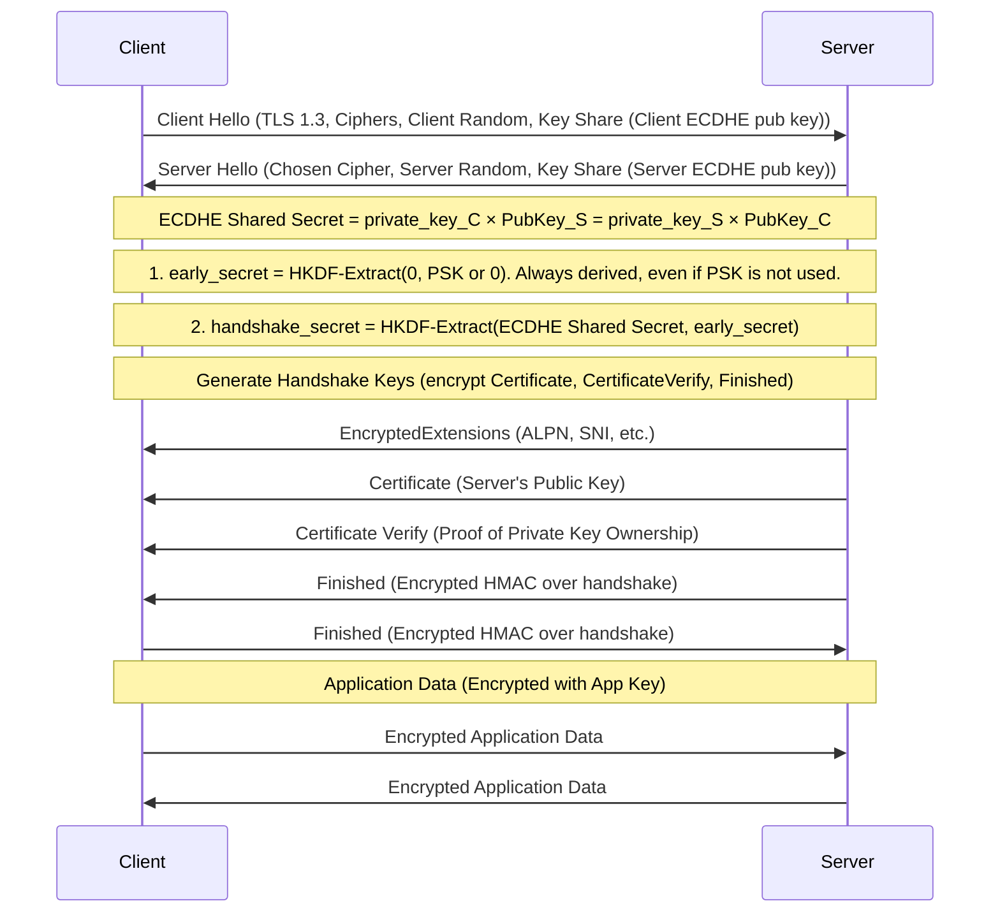
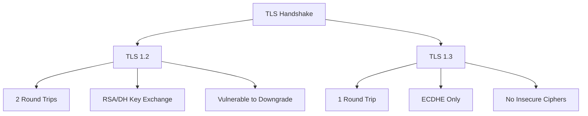

# SSH (Secure Shell) - Complete Guide

SSH (Secure Shell) is a cryptographic network protocol that allows secure remote access and data communication between computers over an unsecured network (like the internet). It encrypts all traffic to prevent eavesdropping, connection hijacking, and other attacks.

### **Telnet vs. SSH**
| Feature       | Telnet | SSH (Secure Shell) |
|--------------|--------|-------------------|
| **Encryption** | ❌ No (plain text) | ✅ Yes (encrypted) |
| **Port**      | 23     | 22                |
| **Security**  | Vulnerable to eavesdropping | Secure (uses cryptography) |
| **Authentication** | Basic (username/password) | Supports keys, certificates, 2FA |
| **Modern Use** | Mostly deprecated | Standard for remote access |

**Why SSH Replaced Telnet?**  
Telnet sends everything (including passwords) in **clear text**, making it easy for hackers to intercept. SSH encrypts all traffic, making it the **secure alternative**.

---

## 1. How SSH Works
SSH works on a **client-server model**:
- **SSH Client**: Initiates the connection (e.g., `ssh` command, PuTTY, MobaXterm).
- **SSH Server**: Listens for incoming connections (usually on **port 22**).

### Key Concepts:
- **Encryption**: Uses strong cryptographic algorithms (AES, ChaCha20) to secure data.
- **Authentication**: Verifies the identity of the client and server.
- **Integrity**: Ensures data isn’t modified in transit (using HMAC-SHA2).


## 2. Key Files Involved

- **Client-side**:
  - `~/.ssh/id_rsa` (private key)
  - `~/.ssh/id_rsa.pub` (public key)
  - `~/.ssh/known_hosts` (verified server keys)
  - `~/.ssh/config` (client configuration)

- **Server-side**:
  - `/etc/ssh/sshd_config` (server configuration)
  - `/etc/ssh/ssh_host_*` (server host keys)
  - `~/.ssh/authorized_keys` (allowed client public keys)
  
## 3. SSH Authentication Methods
### a) Password Authentication
- The client logs in with a username and password.
- **Weakness**: Vulnerable to brute-force attacks.

### b) Public Key Authentication (Recommended)
- Uses a **key pair**:
  - **Private Key** (stored on the client, must be kept secret).
  - **Public Key** (stored on the server in `~/.ssh/authorized_keys`).
- More secure than passwords (resistant to brute force).


---

## 4. SSH Key Generation
Generate a key pair using:
```bash
ssh-keygen -t ed25519 -C "<comment>"  # Best for modern systems
```
- Keys are stored in ~/.ssh/id_algorithm (e.g., id_ed25519, id_rsa).
- The .pub file is the public key (can be shared).
- authorized_keys → Who can access the server? (Client keys)
- known_hosts → Is this the real server? (Server keys)


# Why `authorized_keys` Needs `chmod 600` Permissions

The `~/.ssh/authorized_keys` file must have strict permissions (`600`) for security reasons. Here's why:

---

## 1. What `chmod 600` Means
- **`6` (Owner)**: Read (`4`) + Write (`2`) = `6`  
- **`0` (Group)**: No permissions  
- **`0` (Others)**: No permissions  

This means:  
✅ **Only the file owner** (you) can read or modify it.  
❌ **No other user or process** (even in the same group) can access it.

---

## 2. Why Strict Permissions Are Required
### a) SSH Server Enforces Strict Checks
- The SSH daemon (`sshd`) **refuses to use `authorized_keys` if permissions are too loose** (e.g., `644`).  
- You'll see errors like:  
  `Permission denied (publickey).`  
  `Bad owner or permissions on ~/.ssh/authorized_keys.`

### b) Prevents Unauthorized Modifications
- If **group/others** have write (`622`, `666`, etc.), an attacker could:  
  - Add their own public key → Gain access to your account  
  - Delete existing keys → Lock you out  

### c) Blocks Information Leaks
- If readable by others (`604`, `644`), malicious users could:  
  - Steal the list of authorized public keys  
  - Use them for targeted attacks  

---

## 3. How to Fix Permissions
`chmod 600 ~/.ssh/authorized_keys`  
`chown $USER:$USER ~/.ssh/authorized_keys`  
*(Replace `$USER` with your username)*

---


## 4. What Happens If Permissions Are Wrong?
- SSH will ignore `authorized_keys`, falling back to:  
  - Password authentication (if enabled)  
  - Or deny access entirely  
- Example error in logs:  
  `Authentication refused: bad ownership or modes for authorized_keys`

### Key Takeaway  
`chmod 600` ensures **only you** can modify `authorized_keys`, preventing unauthorized SSH access. This is a critical security requirement enforced by SSH. 🔒


# [SSH Tunneling](https://iximiuz.com/en/posts/ssh-tunnels/)
[Youtube Video](https://youtu.be/MOKnAzKbRS0?si=oQhHedUXcNbI5f_T)


Ofcourse you're still logging into sshd_address, so you're gonna need to setup keys before or it will ask for password for running these commands.


# **SSH Connection Packet Flow (Example: OpenSSH Client → OpenSSH Server)**


## 1. TCP Handshake (Unencrypted)
```plaintext
Client -> Server: SYN
Server -> Client: SYN-ACK
Client -> Server: ACK
```

## 2. Protocol Version Exchange (Unencrypted Plaintext)
```plaintext
Server -> Client: "SSH-2.0-OpenSSH_8.9p1\r\n"
Client -> Server: "SSH-2.0-OpenSSH_9.0p1\r\n"
```
*Note: Connection terminates if version mismatch occurs*

## 3. Algorithm Negotiation (Unencrypted, with Random Cookies)
**Server → Client: SSH_MSG_KEXINIT**
```yaml
Cookie: 16 random bytes (0x1fe3...a7d2)
Supported Algorithms:
  Key Exchange: 
    - curve25519-sha256
    - ecdh-sha2-nistp256
  Encryption:
    - aes256-gcm@openssh.com
    - chacha20-poly1305
  MAC:
    - hmac-sha2-256
  Compression:
    - none
    - zlib
```

**Client → Server: SSH_MSG_KEXINIT**
```yaml
Cookie: 16 random bytes (0x8b2c...f4e1)
Supported Algorithms:
  Key Exchange: curve25519-sha256
  Encryption: aes256-gcm@openssh.com
  MAC: hmac-sha2-256
  Compression: none
```

## 4. Key Exchange (Server Authentication)
**Server → Client: SSH_MSG_KEX_ECDH_REPLY**
```yaml
- Server Public Host Key: RSA/SHA-256
- Server ECDH Public Key: curve25519
- Signature: [exchange hash(of exchange data that containes shared secret) signed with server's private key, Proves the server owns the public host key]
```

**Client Actions:**
1. Verify host key against `~/.ssh/known_hosts` (or prompts the user for trust).
2. **First-Connection Trust**: On first connection, the client must manually verify the server’s host key fingerprint (or trust it blindly, risking MITM).
3. Compute shared secret (ECDH) → derive session keys
4. Validate server's signature

## 5. Encryption Activation
```plaintext
Client -> Server: SSH_MSG_NEWKEYS ("Switch to encrypted channel")
Signals: "I’m switching to encryption now."
Sent unencrypted, but no sensitive data is exposed.

Server -> Client: SSH_MSG_NEWKEYS (Acknowledgment)
Acknowledges: "I’m also switching to encryption."
```
*All subsequent traffic encrypted with session keys*

## 6. Authentication (Public Key Method)
**Client → Server: SSH_MSG_USERAUTH_REQUEST**
```yaml
Username: "alice"
Auth Method: "publickey"
Public Key Fingerprint: SHA256:Abc...xyz
```

**Server Actions:**
1. Check `~/.ssh/authorized_keys` for matching key
2. If found → challenge client

**Server → Client: SSH_MSG_USERAUTH_PK_OK**
```yaml
Random number R: [encrypted with client's public key]
```

**Client Actions:**
1. Decrypt R with private key
2. Sign (R + session ID)

**Client → Server: SSH_MSG_USERAUTH_REQUEST**
```yaml
Signature: [proof of private key ownership]
```

**Server → Client: SSH_MSG_USERAUTH_SUCCESS**

## 7. Channel Setup (Encrypted)
**Client → Server: SSH_MSG_CHANNEL_OPEN**
```yaml
Channel type: "session"
Sender channel ID: 0
Initial window size: 2097152
Max packet size: 32768
```

**Server → Client: SSH_MSG_CHANNEL_OPEN_CONFIRMATION**
```yaml
Recipient channel ID: 0
Sender channel ID: 1
Window size: 2097152
Max packet size: 32768
```

## 8. Command Execution (Encrypted)
**Client → Server: SSH_MSG_CHANNEL_REQUEST**
```yaml
Recipient channel: 1
Request type: "exec"
Command: "/bin/ls -l"
```

**Server → Client: SSH_MSG_CHANNEL_DATA**
```yaml
Data: [AES256-GCM encrypted output of ls -l]
```

## 9. Termination (Encrypted)
```plaintext
Client -> Server: SSH_MSG_DISCONNECT (Graceful close)
[TCP FIN handshake follows]
```

---

### **Packet Structure** (Post-encryption):
   ```
   Encrypted SSH Packet:
   +---------------------+-------------------+-------------------+
   | Length (4 bytes)    | Padding (n bytes) | Payload (m bytes) |
   | MAC (if not AEAD)   |                   |                   |
   +---------------------+-------------------+-------------------+
   ```

---

### **Wireshark-Friendly Breakdown**:
- Filter for `tcp.port == 22` to see:
  - Unencrypted: Version strings + `KEXINIT` packets.
  - Post-`NEWKEYS`: Encrypted blobs (unless decrypted with a keylog file).

This matches RFC 4253 (SSH Transport Layer Protocol, [Architecture](https://en.wikipedia.org/wiki/Secure_Shell#Architecture)) and real-world implementations like OpenSSH.


# Transport Layer Security (TLS)
TLS is the backbone of secure internet communications, protecting data as it travels across networks. This cryptographic protocol ensures privacy, integrity, and authentication for online interactions ranging from web browsing to email exchanges.

### [TLS 1.3](https://www.gabriel.urdhr.fr/2022/02/26/tls1.3-intro/)

**HKDF (HMAC-based Extract-and-Expand Key Derivation Function)** is a cryptographic key derivation function based on HMAC.

#### **Why ClientRandom is Still Mandatory (Even with ECDHE)**
Binds the Entire Handshake

The Finished message includes a hash of all handshake messages, including ClientRandom.
This ensures no part of the handshake was replayed or modified.

Session keys would depend only on g^x and g^y.
<br/> 
If (due to a bug) x or y repeated, the same session key would be derived twice → replay possible!
<br/> 
ClientRandom ensures even if ECDHE randomness fails, keys are still unique.
In PSK mode (no ECDHE), ClientRandom is the only source of freshness.

While ClientRandom and ServerRandom are not directly used as explicit inputs to the HKDF (HMAC-based Extract-and-Expand Key Derivation Function) steps for key derivation, they are included in the **handshake transcript hash**, which is a critical input to the key derivation process. This ensures that the derived keys are **unique** and **dependent on the entire handshake**, including the randomness exchanged.





### Comparison Diagram:

Mermaid Live Editor (https://mermaid.live)