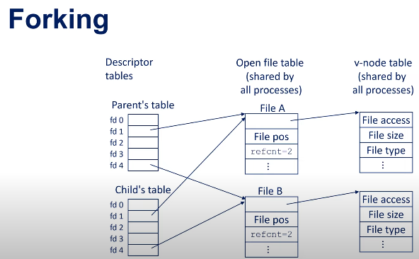

# [File access](https://www.youtube.com/watch?v=rW_NV6rf0rM)

That depends on how you define "share" and which memory segment you're talking about, but the short answer is **yes, they initially share the same physical memory, but this sharing is immediately broken upon modification.**

The mechanism that makes this possible is called **Copy-on-Write (COW)**.

---

## 1. The Principle: Copy-on-Write (COW) 🐮

When the `fork()` system call is executed, the operating system (OS) does **not** immediately duplicate all of the parent process's memory (which can be gigabytes). Instead, it uses a clever optimization called Copy-on-Write (COW):

* **Virtual vs. Physical Memory:** The child process gets a separate, distinct **virtual address space** (its own view of memory). However, both the parent and child's virtual address spaces are initially mapped to the **exact same physical memory pages** in RAM.
* **Permissions:** The OS marks these shared pages as **read-only**.
* **Sharing:** As long as both processes only **read** the data (like the program code or initialized variables), they share the same physical memory, saving time and RAM. 
* **Copying:** The moment **either** the parent or the child attempts to **write** to a shared memory page, a **page fault** occurs. The OS intercepts this, allocates a new physical memory page, copies the original data to the new page, updates the writing process's page table to point to the new private copy, and then sets the new copy to be writable.

From that point on, the two processes have their own private copy of that specific memory page, and changes in one process are invisible to the other.

---

## 2. Shared vs. Copied Segments

While the COW mechanism applies broadly, the following segments are handled differently:

| Memory Segment | Fork Behavior | Parent/Child Interaction |
| :--- | :--- | :--- |
| **Code Segment (Text)** | **Shared.** | Always shared and read-only. They execute the exact same instructions. |
| **Stack, Heap, Data** | **COW.** | Initially shared (via COW), but a write by either process forces a private copy of the affected memory page. **Changes are NOT seen by the other.** |
| **Shared Memory (Explicit IPC)** | **Shared.** | Memory allocated using special mechanisms like `shmget` or `mmap` with the `MAP_SHARED` flag **is truly shared** and visible to both processes, even after writes. This is the exception to the COW rule. |
| **File Descriptors** | **Shared.** | File descriptors (for open files, network sockets, etc.) are **shared**. They both point to the same entry in the kernel's file table. If one process reads from the file, the file pointer advances for the other as well. |

### 1. File Descriptor (fd) Table (Per-Process in PCB)

This is a table that **each process** has uniquely for itself. It's the process's interface to accessing files.

*   **Purpose:** To keep track of which files this specific process has open.
*   **Contents:** An array of integers (the file descriptors: 0, 1, 2, 3...). Each entry is simply a pointer (or an index) to an entry in the global **Open File Table**.
*   **Key Point:** The same file descriptor number (e.g., `3`) in two different processes point to *different entries* in the Open File Table (and thus potentially different files), unless they are related (e.g., after a `fork()`).

**Example:** When a process calls `open("myfile.txt", O_RDONLY)`, the OS:
1.  Finds the file's i-node.
2.  Creates an entry in the **Open File Table**.
3.  Finds the smallest free number in the process's **fd table** (say, `3`).
4.  Makes entry `3` point to the new Open File Table entry.
5.  Returns the integer `3` (the file descriptor) to the process. The process then uses `3` in subsequent `read()`, `write()`, and `close()` calls.

---

### 2. Open File Table (System-Wide)

This is a single table maintained by the operating system kernel, shared by all processes.

*   **Purpose:** To maintain the state of every open file in the system. Each entry is called an **open file description**.
*   **Contents:** Each entry contains crucial information about *how* a file is being accessed:
    *   A pointer to the **vnode/i-node table** entry for the actual file.
    *   The **current file offset** (where the next read/write will occur).
    *   The **access mode** (read-only, write-only, etc.).
    *   The **status flags** (e.g., blocking/non-blocking).
    *   **Reference count**: The number of file descriptors (from any process) that point to this open file description.
*   **Key Point:** This is where the magic of **shared file offsets** happens. If two file descriptors (even from different processes) point to the *same* Open File Table entry, they share the same file offset.

**Example:** After a `fork()`, the child process inherits copies of the parent's file descriptors. The fd `3` in both the parent and child point to the *same* Open File Table entry. A `read()` by the parent will advance the file offset, so the child's subsequent `read()` will continue from where the parent left off.

---

### 3. Vnode / I-node Table (System-Wide)

This table is also global and contains the essential, persistent metadata about the file itself, *not* about how it's being accessed.

*   **Vnode vs. I-node:** A **vnode** (virtual node) is a generic interface that abstracts different file systems. An **i-node** (index node) is the specific data structure used by traditional Unix file systems (like ext4, UFS). The vnode table contains entries that often wrap an underlying i-node.
*   **Purpose:** To act as the central repository of information for every open file and directory in the system.
*   **Contents:** Information directly from the file system on disk:
    *   **File type** (regular, directory, symbolic link, etc.)
    *   **Permissions** (read, write, execute for user, group, others)
    *   **File size**
    *   **Ownership** (User ID and Group ID)
    *   **Timestamps** (creation, modification, access)
    *   **Pointers to the actual data blocks** on the disk where the file content is stored.
    *   **Reference count**: The number of Open File Table entries and directory entries that point to this vnode/i-node.

**Key Point:** There is only one vnode/i-node table entry per file, regardless of how many processes have it open. This is the "source of truth" for the file's properties.

---
 
 
 

# What are I/O Channels?

An **I/O Channel** is essentially a logical pathway for data to flow between your application and an external resource. Think of it as a "connection" or a "conduit."

The most common type of I/O channel is a **File Descriptor (fd)** in Unix-like systems (or a **Handle** in Windows). This file descriptor can represent many different things:
*   **Network Sockets:** For communication over a network (e.g., a web server talking to a browser).
*   **Pipes:** For communication between processes on the same machine.
*   **Terminals:** For input/output from a command line.
*   **Actual Files:** On a disk.
*   **Devices:** Like your keyboard or mouse.

So, when we say "monitor multiple file descriptors," we're really saying "watch multiple I/O channels to see which ones are ready for reading or writing without making the program wait."

---

### Part 2: What Happens When You Request an I/O Operation? (The CPU's Role)

This is where the magic—and the complexity—lies. The CPU is incredibly fast, but I/O devices (disks, network cards) are incredibly slow by comparison. Having the CPU wait for an I/O operation to finish would be a colossal waste of resources.

Here's the step-by-step process for a typical operation like `read(socket_fd, buffer, size)`:

1.  **The Request:** Your application (running on the CPU) makes a system call (e.g., `read`). This triggers a switch from **user mode** (where your app runs) to **kernel mode** (where the operating system has full hardware access).

2.  **Kernel Takes Over:** The OS kernel receives the request. It checks if the data you want is already available in the kernel's internal buffers.
    *   **Best Case (Data Ready):** If data has already arrived from the network card and is sitting in a buffer, the kernel copies that data directly into your application's `buffer`. The system call completes immediately, and your program continues. This is a **non-blocking** return.

3.  **The Common Case (Data Not Ready):** This is the critical part. If no data is available on the socket:
    *   **In a Blocking I/O Call:** The kernel puts your application's thread to sleep (**blocks it**). The kernel notes that this thread is waiting for data from a specific file descriptor. The CPU is now free to be scheduled to run other threads or processes. Your thread is inactive and consumes no CPU cycles.

4.  **The Hardware Handoff:** The kernel sends the request to the appropriate device driver (e.g., the network driver). The driver then communicates with the physical hardware.

---

### Part 3:  Chips for Handling The I/O Operation

**Key Components Involved:**

1.  **Device Controllers (NICs, Disk Controllers):**
    *   Your **Network Interface Card (NIC)** is a small, specialized computer in itself. It has its own processor, memory, and logic. When the OS's network driver says "wait for data on port 80," the NIC takes over. It handles all the low-level electrical signals, packet assembly, and error checking. Only when a full packet of data has arrived does the NIC signal the CPU.
    *   Similarly, **Disk Controllers** (like SATA or NVMe controllers) manage the complex task of reading magnetic or flash memory from the physical drive, handling error correction, and transferring data.

2.  **[Direct Memory Access (DMA) Controller](../Architecture/DMA.md):**
    *   This is a critical chip. In the old days, the CPU would have to manually copy every byte of data from the device to RAM, which was terribly inefficient.
    *   With **DMA**, the CPU can say to the DMA controller: "Hey, when the network card has a packet ready, put the data directly into this specific memory address in RAM." The DMA controller handles the entire transfer without involving the CPU. Once the transfer is complete, the DMA controller interrupts the CPU to let it know the job is done.

3.  **Interrupt Controller:**
    *   This chip manages hardware **interrupts**. When the NIC has data (via DMA) or the disk read is complete, it sends an electrical signal called an interrupt to the interrupt controller, which then signals the CPU.
    *   The CPU pauses what it's doing, saves its state, and jumps to a special routine called an **Interrupt Service Routine (ISR)** in the device driver. This routine handles the completion of the I/O request.

# The Complete "Waiting" Loop

Let's tie it all together for a blocking read on a socket:

1.  **App calls `read()` -> CPU switches to kernel mode.**
2.  **Kernel checks, no data -> Puts thread to sleep(only bc read() function is blocking, otherwise it wont).**
3.  **Kernel tells NIC driver to watch for data.**
4.  **CPU is scheduled to run other tasks.**
5.  **Data arrives over the network wire.**
6.  **NIC processes the packet, uses DMA to write it to RAM.**
7.  **NIC signals the Interrupt Controller.**
8.  **CPU gets interrupted, runs the NIC's driver code.**
9.  **Driver tells the kernel "data is ready for socket X".**
10. **Kernel marks the thread waiting on socket X as runnable.**
11. **Eventually, the CPU scheduler picks that thread to run again.**
12. **The kernel copies the data from its buffer to the app's buffer.**
13. **The `read()` system call returns successfully, and your application continues.**

---

### How I/O Event Notification Mechanisms Fit In

Mechanisms like **`select`**, **`poll`**, **`epoll`** (on Linux), and **`kqueue`** (on BSD/macOS) are the APIs that allow you to manage the *waiting* part efficiently.

Instead of having one thread block on one I/O channel, you can use these APIs to tell the kernel:

> "Here is a list of 1000 sockets I'm interested in. **Wake me up only when one or more of them is ready** for I/O."

>This allows a single thread to manage thousands of simultaneous connections(SINCE EACH SOCKET IS INDEPENDENT AND CAN SEND AND RECIEVE DATA INDEPENDENTLY). The kernel does the work of tracking which hardware events (interrupts) correspond to which file descriptors in your list and only notifies your application when there's actual work to be done (i.e., when a `read` or `write` is guaranteed to not block).

This is the foundation for high-performance servers (like Nginx, Redis, Node.js) that can handle massive numbers of concurrent connections with relatively few threads.

---
 
 
 

### The Core Problem: The C10K Problem

Imagine a web server that must handle 10,000 simultaneous clients. Using a naive approach of one thread or process per connection, the system would grind to a halt due to the massive context-switching overhead. This is the famous "C10k problem."

The solution is **I/O Multiplexing**: a mechanism that allows a single thread to monitor multiple connections (file descriptors) for readiness. Instead of blocking on one connection, the thread asks the OS: "Which of these 10,000 connections are ready to be read from or written to?" It then only processes the ones that are ready.

`poll`, `kqueue`, and `epoll` are all solutions to this problem.

---

### 1. `poll` - The Portable Improvement

`poll` is a system call introduced to overcome the limitations of its predecessor, `select`.

*   **How it works:** You give `poll` a list of file descriptors (FDs) you're interested in and the events you want to monitor for each (e.g., "ready to read," "ready to write"). The call blocks until at least one of the FDs becomes ready or a timeout occurs.
*   **Key Improvement over `select`:**
    *   **No fixed limit:** Unlike `select`, which has a low maximum FD limit (often 1024), `poll` can theoretically handle any number of FDs because it uses a dynamically sized array.
    *   **More granular events:** It provides more detailed information about what kind of event happened on the FD.
*   **The Scalability Problem:** The fundamental inefficiency remains. When `poll` returns, you must **iterate through the entire list of FDs** to see which ones are ready. This is an O(n) operation every time, which becomes very slow when monitoring tens of thousands of mostly idle connections.

---

### 2. `epoll` - The Linux Scalability Solution

`epoll` is the high-performance, scalable I/O event notification mechanism exclusive to Linux. It was designed to fix the shortcomings of `poll` and `select`.

*   **How it works:** `epoll` uses a different model with three system calls:
    1.  `epoll_create()`: Creates a context (an `epoll instance`).
    2.  `epoll_ctl()`: Used to **add, modify, or remove** FDs from the interest list of that context. This is done once per FD.
    3.  `epoll_wait()`: **Waits for events**. This is the call that blocks. Crucially, when it returns, it only provides the list of FDs that are actually ready. You don't have to iterate through all monitored FDs.

*   **Why it's Scalable (O(1) vs. O(n)):**
    *   The kernel maintains a data structure (often a red-black tree and a ready list) to track the FDs.
    *   When an I/O event occurs on an FD (e.g., data arrives), the kernel quickly moves that FD to a "ready list."
    *   `epoll_wait()` simply returns the contents of this ready list. The work required is proportional to the number of FDs that are ready, **not the total number of FDs being monitored**. This makes it immensely efficient for a large number of mostly idle connections (the "waiting" part of its name).

---

### Summary Table

| Feature | `poll` | `epoll` (Linux) | `kqueue` (BSD/macOS) |
| :--- | :--- | :--- | :--- |
| **Basic Operation** | Pass an array of FDs, check all on return. | Register FDs with a context, get only ready FDs back. | Register "events" with a queue, get only triggered events back. |
| **Scalability** | **Poor (O(n))** - Must scan all FDs every time. | **Excellent (O(1))** - Work is proportional to ready FDs. | **Excellent (O(1))** - Work is proportional to ready events. |
| **Portability** | Very portable (POSIX standard). | Linux only. | BSD systems (including macOS). |
| **Flexibility** | Basic (FD read/write/error events). | Basic (FD events, edge-triggered vs level-triggered). | Very High (FDs, signals, file mods, timers, process state). |
| **Core System Calls** | `poll()` | `epoll_create()`, `epoll_ctl()`, `epoll_wait()` | `kqueue()`, `kevent()` |

### Conclusion

*   Use **`poll`** only for maximum portability when you know the number of connections will always be small.
*   Use **`epoll`** when building high-performance network applications on Linux. It's the standard for modern Linux servers (e.g., Nginx, Node.js).
*   Use **`kqueue`** when building high-performance applications on BSD or macOS. It offers similar performance to `epoll` with greater flexibility.

Most modern high-level networking frameworks (like Python's `asyncio` or Go's `net` package) abstract these mechanisms away, using the most efficient one available for the operating system they are running on.