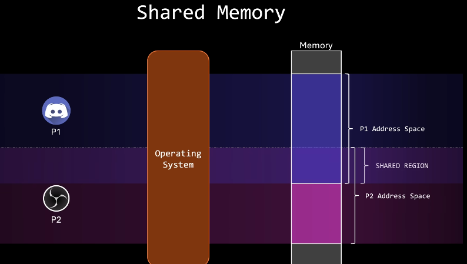
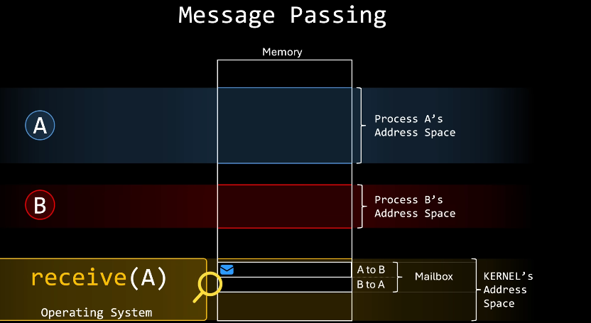
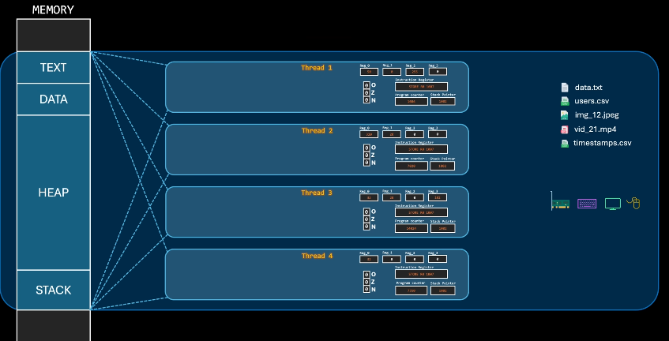
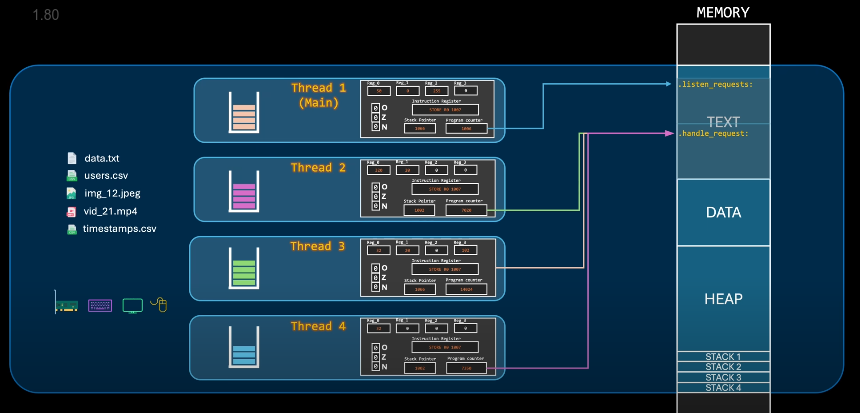
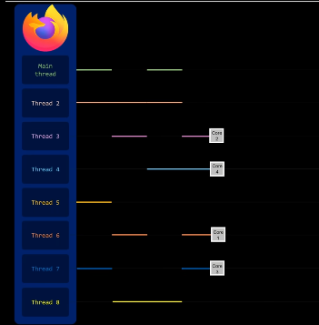
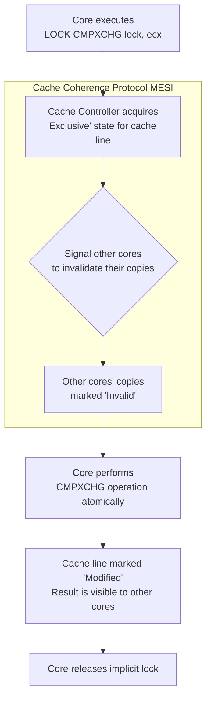
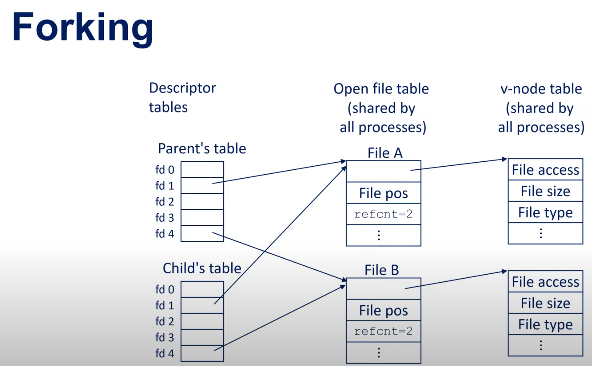

# [Inter Process Communication](https://www.youtube.com/watch?v=Y2mDwW2pMv4&list=PL9vTTBa7QaQPdvEuMTqS9McY-ieaweU8M&index=4)




| Mechanism | Type (Comm/Sync) | Description | Key Use Case |
| :--- | :--- | :--- | :--- |
| **Pipes** | Communication | Unidirectional data channel. `A | B` where A writes, B reads. | Connecting stdout of one process to stdin of another. |
| **Named Pipes (FIFO)** | Communication | Like a pipe, but has a filename in the filesystem and can be used by unrelated processes. | Communication between unrelated processes on the same machine. |
| **Signals** | Sync (mostly) | A limited form of inter-process communication used to notify a process that an event has occurred (e.g., `SIGKILL`, `SIGINT`). | Asynchronous event notification (e.g., to terminate a process). |
| **Message Queues** | Communication | A linked list of messages stored in the kernel, allowing processes to read/write messages with a type. | Structured message passing; can prioritize messages. |
| **Shared Memory** | Communication | Multiple processes access the same block of memory. **Fastest** method. | High-speed data sharing (e.g., large datasets, scientific computing). |
| **Semaphores** | Synchronization | A counter used to control access to a shared resource by multiple processes (to avoid race conditions). | **Mutual Exclusion** (e.g., protecting a shared variable or file). |
| **Sockets** | Communication | Endpoints for bidirectional communication, often over a network. Can be used on the same machine. | Network communication (e.g., web browsers and servers). |


# [Threads](https://www.youtube.com/watch?v=M9HHWFp84f0&list=PL9vTTBa7QaQPdvEuMTqS9McY-ieaweU8M&index=5)




# [Race conditions](https://www.youtube.com/watch?v=bhpzTWtee2A)

Basically only difference is one is **boolean** and other is **integer**.
| Feature | Mutex (Mutual Exclusion) | Semaphore |
| :--- | :--- | :--- |
| **Basic Concept** | A lock with a single owner. | A signaling counter with no owner. |
| **Ownership** | **Strict ownership.** The thread that locks it must unlock it. | **No ownership.** Any thread can signal (post) or wait. |
| **Count** | Binary (0 or 1). It's either locked or unlocked. | A non-negative integer counter. |
| **Operations** | `lock()` (or `acquire()`) and `unlock()` (or `release()`). | `wait()` (or `P()`, `acquire()`) and `signal()` (or `V()`, `release()`). |
| **Primary Purpose** | **Mutual Exclusion:** To protect a critical section of code. | **Signaling & Coordination:** To limit access to a resource pool or coordinate threads. |
| **Performance** | Generally lighter weight and faster. | Can be slightly heavier due to more complex management. |
| **Use Case** | Ensuring only one thread at a time can execute a piece of code. | 1. Limiting access to **N** instances of a resource (e.g., database connections).<br>2. Signaling an event from one thread to another (e.g., producer-consumer). |


In assembly, a mutex starts its life as a simple memory location and a `LOCK CMPXCHG` instruction. The sophisticated sleeping/waking behavior is built on top of this fundamental hardware primitive by the operating system.


1.  **An atomic hardware instruction** provided by the CPU.
2.  **A waiting mechanism** provided by the operating system.

Let's break it down, starting with the core concept and moving to the assembly.

### The Core Problem: The Need for Atomicity

Imagine the naive way to try and implement a lock:

```c
// WARNING: This is BROKEN code.
void init_lock(int *lock) { *lock = 0; } // 0 = free, 1 = taken

void broken_lock(int *lock) {
    while(*lock == 1) { /* spin */ } // Wait if taken
    *lock = 1;                       // Now take it!
}

void broken_unlock(int *lock) {
    *lock = 0;
}
```

The critical issue is that the check `while(*lock == 1)` and the set `*lock = 1` are **two separate operations**. A context switch could happen *between* them:

1.  **Thread A** runs `broken_lock` on a free lock (`lock=0`). It checks `while(*lock == 1)` and exits the loop.
2.  **The OS preempts Thread A** before it can execute `*lock = 1`.
3.  **Thread B** now runs `broken_lock` on the same free lock (`lock=0`). It checks `while(*lock == 1)`, finds it free, exits the loop, and **sets `*lock = 1`**.
4.  **Thread B** enters its critical section.
5.  **The OS switches back to Thread A**, which now executes its next instruction: `*lock = 1`. It does this and enters its critical section.

Now **both threads are in the critical section at the same time**. The lock failed. We need a way to perform the **check and set as a single, indivisible (atomic) operation**.

---

### The Hardware Solution: Atomic Instructions

CPU architects provide special instructions designed specifically for this purpose. The most common one is **Compare-and-Swap (CAS)** or an equivalent like **Test-and-Set (TAS)** or **Load-Link/Store-Conditional (LL/SC)**.

#### Example: Test-and-Set (TAS)

The `TAS` instruction does one thing, atomically:
1.  It reads the current value from a memory address.
2.  It writes a `1` to that same memory address.
3.  It returns the *original* value it read.

The key is that the CPU guarantees **no other core or thread can interfere** during this read-write cycle. It's all one operation.

Let's see how we use it to build a **spinlock** (a mutex that busy-waits).

**Pseudocode:**
```c
// Atomically swap 'new_value' into *address and return the old value.
int atomic_swap(int new_value, int *address) {
    // This is implemented by a single CPU instruction.
    // The hardware handles the atomicity.
}

void spin_lock(int *lock) {
    // Keep trying until we succeed
    while (atomic_swap(1, lock) == 1) {
        // The lock was already held (value was 1).
        // Our swap set it to 1 again and got the old value (1).
        // So we just wait (spin) and try again.
    }
    // If we get here, the atomic_swap found the lock value was 0 (free).
    // It set it to 1 (taken) and returned the old value 0.
    // We now own the lock.
}

void spin_unlock(int *lock) {
    // Just set the lock back to 0 (free).
    // This doesn't need to be atomic by itself because
    // the thread doing the unlock is the owner.
    *lock = 0;
}
```

---

### x86 Assembly View

On x86, the fundamental instruction for building these primitives is `LOCK CMPXCHG` (Compare-and-Exchange with a `LOCK` prefix), or historically, `XCHG` has implied lock semantics.

Let's look at a simple spinlock implementation. The `lock` variable is `0` (free) or `1` (taken).

**Acquiring the Lock (spin_lock):**

```asm
; ; ; ; int lock; ; ; ; 
; ; ; ; ; ; ; ; ; ; ; ; 
; ; ; ; spin_lock:; ; ; ; 
    mov   ecx, 1          ; ECX = 1 (the value we want to swap in)
.try:
    ; Atomically do: if (eax == [lock]) then [lock] = ecx, else eax = [lock]
    ; We will set eax to 0 (the value we *expect* the lock to be if it's free)
    mov   eax, 0          ; EAX = 0 (expected value)
    lock cmpxchg [lock], ecx  ; **ATOMIC MAGIC HAPPENS HERE**

    ; After the operation, the Zero Flag (ZF) is set if eax == [lock] was true (success).
    ; If it failed, eax is loaded with the current value of [lock].
    test  eax, eax        ; Check what's in EAX now
    jnz   .try            ; If EAX != 0, the lock was taken (1), so try again.

    ; If we get here, we got the lock!
    ret

; ; ; ; spin_unlock:; ; ; ; 
    mov   dword [lock], 0  ; Just set it to zero. The owner is the only one who can do this.
    ret
```

**How the `LOCK CMPXCHG` instruction works:**
1.  The CPU asserts a **hardware bus lock** or a **cache lock**, preventing any other core from accessing this memory location for the duration of the instruction.
2.  It compares the value in the `EAX` register (0) to the value at the memory address `[lock]`.
3.  If they are equal (the lock was free, `[lock]` was 0), it swaps the value in `ECX` (1) into the memory address `[lock]` and sets the Zero Flag (ZF=1).
4.  If they are *not* equal (the lock was taken, `[lock]` was 1), it does *not* swap. Instead, it loads the current value from `[lock]` (1) into the `EAX` register and clears the Zero Flag (ZF=0).

This single instruction performs the entire "check-if-free-and-take-it" operation atomically.

---

### Beyond Spinning: Real Mutexes and the OS

A pure spinlock is inefficient. If a thread can't get the lock, it wastes CPU cycles spinning until its time slice expires. Real-world mutexes (like those in `pthreads` or the Windows API) are more sophisticated. They combine this atomic check with a call to the operating system kernel to avoid wasting CPU time.

A typical "hybrid" mutex works like this:

1.  **Fast Path (User-Space):** It first tries an atomic operation (like above) to acquire the lock. If successful, it's extremely fast (no OS interaction).
2.  **Slow Path (Kernel-Space):** If the atomic operation fails (lock is held), it makes a **system call** (e.g., `futex` on Linux, `WaitForSingleObject` on Windows).
    *   The OS kernel now takes over. It **suspends** the thread, marks it as waiting for the lock, and removes it from the run queue. This consumes **zero CPU cycles**.
    *   The OS also adds the thread to a wait queue associated with the mutex's memory address.
3.  **On Unlock:** When the lock owner calls `unlock`, it uses an atomic instruction to release the lock. It then makes a system call to tell the OS to **wake up** one or all of the waiting threads from the queue.

This hybrid approach gives the best of both worlds: the speed of a spinlock when there's no contention, and the efficiency of not burning CPU when there is.

### Summary

| Level | Mechanism | Pros | Cons |
| :--- | :--- | :--- | :--- |
| **Hardware** | Provides **atomic instructions** (`CMPXCHG`, `TAS`). | Makes the fundamental "check-and-set" operation possible. | Low-level, difficult to use correctly on its own. |
| **Spinlock** | Uses atomic instructions in a **busy loop**. | Very fast if lock is held briefly. | Wastes CPU cycles if lock is held for a long time. |
| **Real Mutex** | **Hybrid approach:** tries user-space atomic op first, then calls the **OS kernel** to sleep. | Efficient, doesn't waste CPU. Best for general use. | Slower than a spinlock in the uncontended case due to potential system call overhead. |


# [Atomicity]()

**The hardware temporarily "locks" the specific cache line containing the memory address, performs the entire operation and ensures all other cores see the change as a single, indivisible event**





### The Core Problem: Caches and Coherence

In a multicore system, each core has its own small, fast, local **cache** (L1, L2) to avoid slow accesses to main memory (DRAM). A variable (like our mutex `lock`) can be cached by multiple cores simultaneously.

If Core 1 tries to atomically increment a variable cached by Core 2, we have a problem. The hardware must ensure that:
1.  **No other core can read or write** the target memory location during the operation.
2.  All other cores see the **final result** of the atomic operation, not a partial or intermediate state.
3.  The change is **propagated correctly** to all other caches that hold a copy of that data.

This is achieved through two main mechanisms: **Cache Locking** and **Cache Coherence Protocols**.

---

### 1. Cache Locking: The "LOCK" Prefix

When an assembly instruction is prefixed with `LOCK` (explicitly or implicitly, like with `XCHG`), it signals the CPU to assert a **hardware lock**.

*   **What it locks:** It doesn't lock the entire bus or system. Modern CPUs lock only the specific **cache line** (a small block of memory, usually 64 bytes) that contains the memory address being operated on.
*   **How it works:**
    1.  The core executing the `LOCK CMPXCHG [lock], ecx` instruction tells its cache controller to acquire an **exclusive** or **modified** state for that cache line.
    2.  The cache controller uses the **MESI protocol** (or its variants like MOESI) to invalidate all other copies of that cache line in other cores' caches. This forces all other cores to request the data from this core if they need it.
    3.  While the cache line is in this "locked" or exclusive state, the core performs the entire read-modify-write operation (the compare and exchange) completely alone.
    4.  Once the operation is complete, the core releases the "lock," and the updated cache line is eventually flushed back to main memory and can be shared with other cores again.

This entire process is handled transparently by the CPU's cache coherence hardware.

**Visualization of the Process:**


### 2. [Cache Coherence Protocol: MESI](https://youtu.be/bBSmcFoFRYw?si=TVnoxxvt-gOaZ6Rb&t=428)

MESI is the secret sauce that makes multicore systems work. It defines the states a cache line can be in and the rules for moving between states. The states are:


*   **E (Exclusive):** The cache line is clean (matches main memory), but only this core has a copy. It can be written to, moving to the Modified state.
*   **M (Modified):** The cache line is dirty (different from main memory) and this core is the only one that has a copy. This core has exclusive ownership and must write it back to memory later.
*   **S (Shared):** The cache line is clean and potentially cached by other cores. It is read-only.
*   **I (Invalid):** The cache line does not contain valid data.

**How it enables atomic operations:**

1.  To perform a write, a core must have the cache line in either the **Exclusive (E)** or **Modified (M)** state.
2.  The `LOCK` prefix forces this to happen. The core's cache controller sends a message on the interconnect bus to all other cores saying: "I intend to write to this address. Invalidate your copies."
3.  Other cores receive this message and mark their corresponding cache lines as **Invalid (I)**. They acknowledge the message.
4.  Only after the executing core receives all acknowledgements and has exclusive access does it proceed with the atomic read-modify-write operation. It places the cache line in the **Modified (M)** state.
5.  Now, any other core that tries to read that memory address will see its cache line is invalid. It will send a request for the data, and the owning core will eventually flush the updated data back to main memory and/or to the requesting core's cache (changing its state to **Shared (S)**).

### A Concrete Example: `LOCK INC [value]`

Let's trace `LOCK INC [value]` on a dual-core system. Assume `value` is initially 5 and cached by both Core 0 and Core 1 in the **Shared (S)** state.

1.  **Core 0** executes `LOCK INC [value]`.
2.  Core 0's cache controller sees the `LOCK` prefix. It broadcasts an **RFO (Read-For-Ownership)** message on the bus.
3.  **Core 1** receives the RFO message and marks its copy of the cache line as **Invalid (I)**. It sends an acknowledgement.
4.  Core 0's cache line transitions to **Exclusive (E)**, then immediately to **Modified (M)** as it completes the `INC` operation, changing the value to 6.
5.  **Core 1** later tries to read `value`. It sees its cache line is Invalid and sends a Read request.
6.  Core 0 sees the request. It writes the modified data (6) back to main memory and also sends it to Core 1's cache. Both cores' cache lines for `value` now transition to the **Shared (S)** state with the correct value, 6.

### Key Takeaways

*   **Atomicity is a Hardware Feature:** It's not implemented in software; it's a guarantee provided by the CPU hardware.
*   **It's About Cache Lines:** The lock is applied to a specific cache line, not the whole system.
*   **Coherence Protocol is Key:** The MESI protocol ensures all cores have a consistent view of memory by controlling the state of cache lines.
*   **Performance Cost:** Atomic operations are expensive because they require invalidating caches on other cores and communicating over the shared bus. This is why minimizing shared data in concurrent programming is so critical for performance.

# [File access](https://www.youtube.com/watch?v=rW_NV6rf0rM)



### 1. File Descriptor (fd) Table (Per-Process in PCB)

This is a table that **each process** has uniquely for itself. It's the process's interface to accessing files.

*   **Purpose:** To keep track of which files this specific process has open.
*   **Contents:** An array of integers (the file descriptors: 0, 1, 2, 3...). Each entry is simply a pointer (or an index) to an entry in the global **Open File Table**.
*   **Key Point:** The same file descriptor number (e.g., `3`) in two different processes point to *different entries* in the Open File Table (and thus potentially different files), unless they are related (e.g., after a `fork()`).

**Example:** When a process calls `open("myfile.txt", O_RDONLY)`, the OS:
1.  Finds the file's i-node.
2.  Creates an entry in the **Open File Table**.
3.  Finds the smallest free number in the process's **fd table** (say, `3`).
4.  Makes entry `3` point to the new Open File Table entry.
5.  Returns the integer `3` (the file descriptor) to the process. The process then uses `3` in subsequent `read()`, `write()`, and `close()` calls.


---

### 2. Open File Table (System-Wide)

This is a single table maintained by the operating system kernel, shared by all processes.

*   **Purpose:** To maintain the state of every open file in the system. Each entry is called an **open file description**.
*   **Contents:** Each entry contains crucial information about *how* a file is being accessed:
    *   A pointer to the **vnode/i-node table** entry for the actual file.
    *   The **current file offset** (where the next read/write will occur).
    *   The **access mode** (read-only, write-only, etc.).
    *   The **status flags** (e.g., blocking/non-blocking).
    *   **Reference count**: The number of file descriptors (from any process) that point to this open file description.
*   **Key Point:** This is where the magic of **shared file offsets** happens. If two file descriptors (even from different processes) point to the *same* Open File Table entry, they share the same file offset.

**Example:** After a `fork()`, the child process inherits copies of the parent's file descriptors. The fd `3` in both the parent and child point to the *same* Open File Table entry. A `read()` by the parent will advance the file offset, so the child's subsequent `read()` will continue from where the parent left off.


---

### 3. Vnode / I-node Table (System-Wide)

This table is also global and contains the essential, persistent metadata about the file itself, *not* about how it's being accessed.

*   **Vnode vs. I-node:** A **vnode** (virtual node) is a generic interface that abstracts different file systems. An **i-node** (index node) is the specific data structure used by traditional Unix file systems (like ext4, UFS). The vnode table contains entries that often wrap an underlying i-node.
*   **Purpose:** To act as the central repository of information for every open file and directory in the system.
*   **Contents:** Information directly from the file system on disk:
    *   **File type** (regular, directory, symbolic link, etc.)
    *   **Permissions** (read, write, execute for user, group, others)
    *   **File size**
    *   **Ownership** (User ID and Group ID)
    *   **Timestamps** (creation, modification, access)
    *   **Pointers to the actual data blocks** on the disk where the file content is stored.
    *   **Reference count**: The number of Open File Table entries and directory entries that point to this vnode/i-node.

**Key Point:** There is only one vnode/i-node table entry per file, regardless of how many processes have it open. This is the "source of truth" for the file's properties.