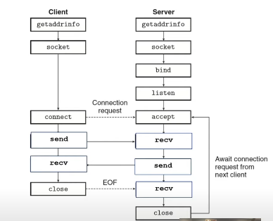

# Socket programming L20

# [Sockets](https://www.youtube.com/watch?v=XXfdzwEsxFk)

A socket is a more general programming interface that can use *multiple* protocols from different layers. `(IP Address + Port + TCP/UDP)` uniquely defines one end of a communication channel.



Since everything is a file in linux, socket is also managed through file descriptors.


### 1. `socket()` - Creating the Endpoint

Think of a socket as a **"communication endpoint"**. This call doesn't involve any networking yet; it just asks the kernel to allocate the internal resources for a future network connection.

*   **What it does:** It creates a socket object inside the kernel and returns a **file descriptor** (an integer) to the application. This file descriptor will be used to refer to this specific socket in all future calls (like `read`, `write`, `close`).
*   **You must specify:**
    *   **Domain (Address Family):** `AF_INET` for IPv4, `AF_INET6` for IPv6, `AF_UNIX` for local inter-process communication.
    *   **Type:** `SOCK_STREAM` for reliable, connection-oriented TCP. `SOCK_DGRAM` for connectionless UDP.
    *   **Protocol:** Usually set to `0` to let the kernel choose the default protocol for the given type (e.g., TCP for `SOCK_STREAM`).

**C Code Example:**
```c
// Create a TCP (SOCK_STREAM) socket for IPv4 (AF_INET)
int server_socket_fd = socket(AF_INET, SOCK_STREAM, 0);
if (server_socket_fd == -1) {
    perror("socket failed");
    exit(EXIT_FAILURE);
}
```
At this point, `server_socket_fd` is just a blank slate. It's not associated with any network interface or port.

---

### 2. `bind()` - Assigning a Name (Address & Port)
```
This call **"binds"** the socket you just created to a specific **network interface** and **port number** on your machine.
you do specify an IP address for the listening socket. But it's not the client's IP (which you don't know yet). It's the IP address of the network interface on the server itself that you want to listen on.

Often, servers use the special address INADDR_ANY (or 0.0.0.0). This tells the OS: "Listen for connections on any and all network interfaces this machine has (Ethernet, Wi-Fi, etc.)."

You could bind to a specific IP (e.g., 192.168.1.10) if the server has multiple IPs(mulitple NIC, wifi, ethernet) and you only want to accept connections on that one.
```
*   **What it does:** It associates the socket with a local "name," which is the combination of an IP address and a port number. This tells the OS: "Hey, any network packets sent to port X on my machine should be given to *this* socket."
*   **Why it's needed:** For a server, you almost always want to `bind()` to a well-known port (e.g., port 80 for HTTP) so clients know where to find you. A client can often skip `bind()`, and the kernel will automatically assign it a random "ephemeral" port.
*   **Key Structure:** You pass a `sockaddr_in` structure (for IPv4) to `bind()` that specifies:
    *   The address family (`AF_INET`)
    *   The port number (converted to network byte order with `htons()`)
    *   The IP address to listen on. `INADDR_ANY` (which is `0`) is a special constant meaning "bind to all available network interfaces on this machine."

**C Code Example:**
```c
// Define the server address we want to bind to
struct sockaddr_in server_addr;
memset(&server_addr, 0, sizeof(server_addr)); // Clear the structure
server_addr.sin_family = AF_INET; // IPv4
server_addr.sin_addr.s_addr = htonl(INADDR_ANY); // Bind to any interface
server_addr.sin_port = htons(8080); // Bind to port 8080

// Now execute the bind
if (bind(server_socket_fd, (struct sockaddr*)&server_addr, sizeof(server_addr)) == -1) {
    perror("bind failed");
    close(server_socket_fd);
    exit(EXIT_FAILURE);
}
```
Now the socket is known to the OS as "the one listening on port 8080." But it's still not active.

---

### 3. `listen()` - Activating the Socket for Connections

**Prerequesties** - read TCP states, **UDP does not have listen() or accept() system calls**, since it is stateless.

This call activates the socket, putting it into a **passive state** where it is ready to **accept incoming connection requests** from clients. It turns the socket into a **"listening socket."**

*   **What it does:** It tells the kernel to start paying attention to the port this socket is bound to. The kernel will then begin to manage the incoming TCP connection handshakes (SYN, SYN-ACK, ACK) for this socket.
*   **The Backlog:** The most important argument is the `backlog`. This defines the maximum length for the **queue of pending connections**. While the server is processing one connection, other clients can try to connect. These pending connections wait in this queue. A typical value might be 5 or 10.
    *   If the queue is full, new connection attempts may be refused, signaling an error to the client.

**C Code Example:**
```c
// Mark the socket as passive and ready to accept connections.
// Set the backlog to 5.
if (listen(server_socket_fd, 5) == -1) {
    perror("listen failed");
    close(server_socket_fd);
    exit(EXIT_FAILURE);
}

printf("Server is now listening on port 8080...\n");
```
**The server is now live and waiting for clients.** The next step, which you would typically do in a loop, is to call `accept()`.

### The Next Step: `accept()`

*   **`accept()`**: This call blocks until a client connection is fully established (i.e., a connection is present in the queue created by `listen()`). It then **creates a brand new socket** for communicating with that specific client and returns its file descriptor. The original listening socket remains untouched and continues to listen for new connections.

---

<br />
<br />


# [Kernel Memory Overview: The Key Structures](https://arthurchiao.art/blog/tcp-listen-a-tale-of-two-queues/)

[](https://github.com/ArthurChiao)


The kernel maintains several interconnected data structures. The most important ones for our purposes are:

1.  **`struct socket`**: The main high-level abstraction. It represents the endpoint to the application and ties together everything else.
2.  **`struct sock` (or `struct inet_sock`)**: The **heart of the socket** in the kernel. This is a massive structure that contains all the protocol-specific state information:
    *   Receive and send buffers
    *   Sequence numbers (for TCP)
    *   The local IP address and port (`sk_rcv_saddr`, `sk_num`)
    *   The remote IP address and port (`sk_daddr`, `sk_dport`)
    *   The current state (e.g., `TCP_LISTEN`, `TCP_ESTABLISHED`)
    *   Pointers to protocol-specific operations (a `struct proto` object, which contains function pointers for `bind`, `listen`, `connect`, etc.)
3.  **`struct sk_buff` (Socket Buffer)**: The most fundamental networking data structure. All network packets are placed into `sk_buff` structures for manipulation as they travel through the kernel's network stack.
4.  **Protocol-Specific Tables**: The kernel maintains hash tables that map port numbers to their associated `struct sock` objects. This is critical for quickly finding which socket an incoming packet belongs to.

---
<br />
<br />
<br />

# The Journey in Kernel Memory

Here’s what happens step-by-step.

#### 1. The `socket()` System Call

**User-Space Action:** `int s = socket(AF_INET, SOCK_STREAM, 0);`

**Kernel-Space Reaction:**
The kernel's `sys_socket()` function is called.

1.  **Allocation:** The kernel allocates and initializes two key structures in its own memory:
    *   A `struct socket` (the general endpoint).
    *   A much larger, protocol-specific `struct sock` (e.g., `struct inet_sock` for IPv4 TCP). This is where all the TCP state will be stored.
2.  **Linking:** These two structures are linked together. The `struct socket` has a pointer called `sk` that points to the `struct sock`.
3.  **Protocol Setup:** The kernel identifies the TCP protocol based on the arguments (`AF_INET`, `SOCK_STREAM`) and sets up the `struct sock`'s function pointers (`sk->sk_prot`) to point to all the TCP-specific functions (e.g., `tcp_bind`, `tcp_connect`, `tcp_listen`). This is how the generic socket code knows how to call the right protocol.
4.  **File Descriptor Link:** The kernel creates a file descriptor in the process's file descriptor table. This FD doesn't point to a file on disk; it points to the new `struct socket`. This is why you can use `read()` and `write()` on sockets—the VFS (Virtual File System) layer treats it like a file.

**State in Kernel Memory After `socket()`:**
A `struct sock` exists, but its fields are mostly empty. The local and remote addresses are zeroed, the state is `TCP_CLOSE`, and the receive/send buffers are empty. The socket is created but nameless and inactive.


---

#### 2. The `bind()` System Call

**User-Space Action:** `bind(s, &my_addr, addr_len);`

**Kernel-Space Reaction:**
The kernel's `sys_bind()` function is called, which eventually calls the protocol-specific `inet_bind()` function (via the `sk->sk_prot->bind` function pointer set during `socket()`).

1.  **Permission & Security Check:** The kernel checks if the process has the right to bind to the requested port (e.g., is it a privileged port < 1024?).
2.  **Port Availability Check:** The kernel checks its protocol bind tables to see if the requested port is already in use by another socket on the same network interface. This prevents the "Address already in use" error.
3.  **Updating `struct sock`:** If the port and address are available, the kernel writes the local IP address and port number into the `struct sock`'s fields (`sk->sk_rcv_saddr`, `sk->sk_num`).
4.  **Updating the Bind Table:** The kernel adds this `struct sock` to the global hash table of bound sockets. This is a critical step. Now, when a packet arrives, the kernel can perform a lookup in this table using the packet's destination port to find the correct `struct sock`.

**State in Kernel Memory After `bind()`:**
The `struct sock` now has a local name (address:port). It is registered in the kernel's lookup tables. It's like a house with an address, but the residents aren't home yet to receive mail.


---

#### 3. The `listen()` System Call

**User-Space Action:** `listen(s, 5);`

**Kernel-Space Reaction:**
The kernel's `sys_listen()` function is called, which calls `inet_listen()`.

1.  **State Change:** The kernel changes the state of the socket from `TCP_CLOSE` to `TCP_LISTEN` within the `struct sock`.
2.  **Allocating the Accept Queue:** This is the most important part. The kernel creates not one, but **two queues** associated with the `struct sock`:
    *   **Accept Queue ( fully established connections )**: This is where connections that have completed the TCP three-way handshake wait until the server calls `accept()` to pick them up. The `backlog` argument you pass to `listen()` primarily sets the maximum size of *this* queue.
    *   **SYN Queue ( incomplete connections )**: This queue holds connection requests that have received the initial `SYN` packet from a client and for which the kernel has responded with `SYN-ACK`. They are waiting for the final `ACK` to complete the handshake. Its size is often controlled by a different system-wide setting.
3.  **Becoming a Listener:** The socket is now marked as a passive listener. Its role for its entire lifetime will be to spawn new active connections (via `accept()`), not to send data itself.

**State in Kernel Memory After `listen()`:**
The `struct sock` is now fully active. It has a state of `TCP_LISTEN` and has two queues attached to it. It is now actively involved in the network stack: whenever a TCP packet with the `SYN` flag set arrives on its port, the network stack will find this `struct sock` via the bind table and pass the packet to its TCP handling functions to begin the connection process.


### Summary: The Life of a Kernel Socket

| System Call | Key Kernel Memory Actions |
| :--- | :--- |
| **`socket()`** | Allocates `struct socket` and `struct sock`. Links them. Sets up protocol ops. Links to a file descriptor. |
| **`bind()`** | Checks port permissions/availability. Writes local address:port to `struct sock`. Adds socket to bind table. |
| **`listen()`** | Changes state to `TCP_LISTEN`. Creates the **accept** and **SYN** queues. The socket is now active. |

This entire intricate setup in kernel memory is what allows your simple user-space server application to handle the complexities of network protocols, concurrency, and data flow efficiently. The kernel does all the heavy lifting; your program just makes requests to it and reaps the benefits.

---
<br />
<br />
<br />


### The Client's Socket Workflow

A typical client program does this:

1.  **`socket()`:** Creates a socket. At this point, it's a "wild" socket not associated with any specific addresses.
2.  **`connect()`:** This is the key function. In the `connect()` call, you **must specify the destination IP address and port** (i.e., the server's address).
    *   The OS now knows: "Okay, this socket is meant to talk to *that specific server* over there."
3.  **Implicit Bind:** When you call `connect()`, the operating system automatically performs an **implicit `bind()`** on your behalf *before* sending the connection request. It binds the socket to:
    *   **Source IP Address:** The IP address of the outgoing network interface (e.g., your Wi-Fi or Ethernet IP, like `192.168.1.15`).
    *   **Source Port Number:** A random, unused **ephemeral port** (usually a high number like `54321`, `54322`, etc.). The OS chooses this automatically.

 ## So, the `connect()` call finalizes the complete socket pairing:
*   **Source:** `(Client's IP, Client's Ephemeral Port)`
*   **Destination:** `(Server's IP, Server's Well-Known Port)` (e.g., `443` for HTTPS)

### Why is the Client's `bind()` Usually Implicit?

You *can* explicitly `bind()` a client socket before connecting, but it's almost never done because:

1.  **You don't care about the source port:** The client just needs *any* available port to communicate from. It doesn't need a fixed, well-known port like a server does.
2.  **You don't care about the source IP:** The client machine might have multiple IP addresses (e.g., Ethernet, Wi-Fi, VPN). You almost always want the OS to choose the correct one based on its routing tables to reach the server. Explicitly binding to the wrong one would break the connection.

The implicit `bind()` is a convenience that handles this automatically and correctly.
