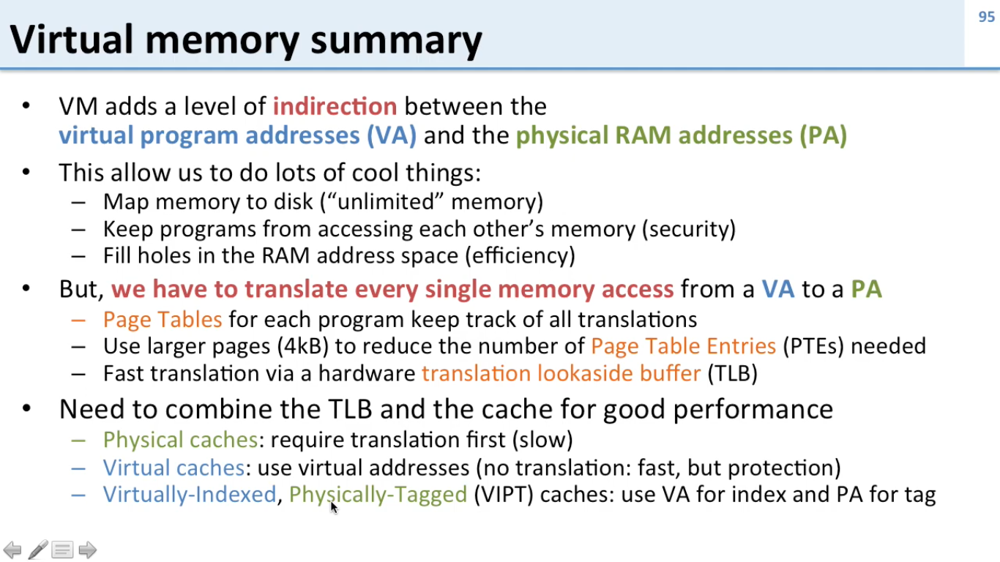
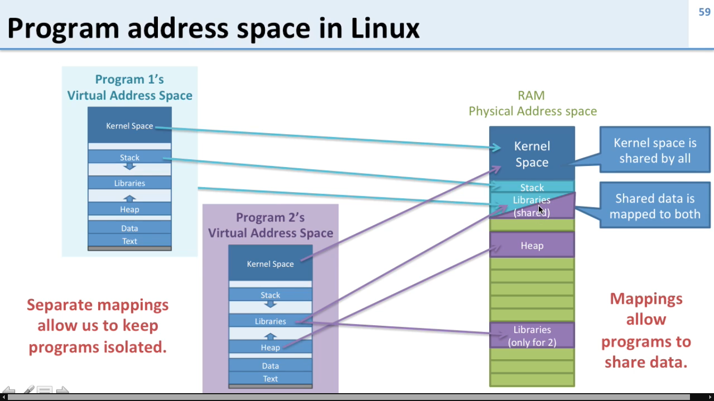
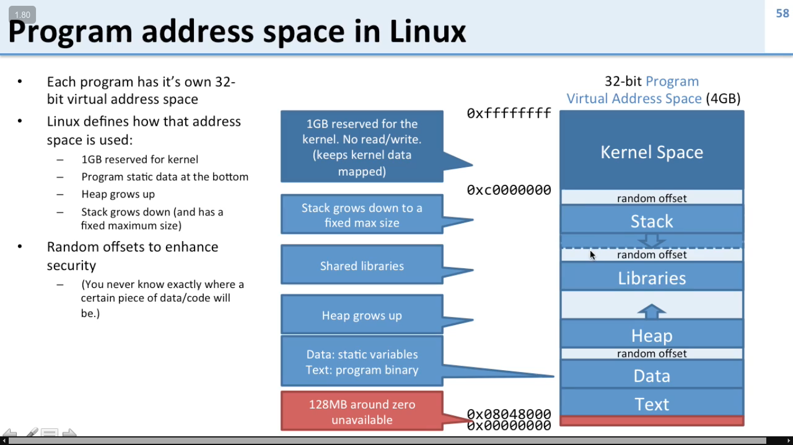
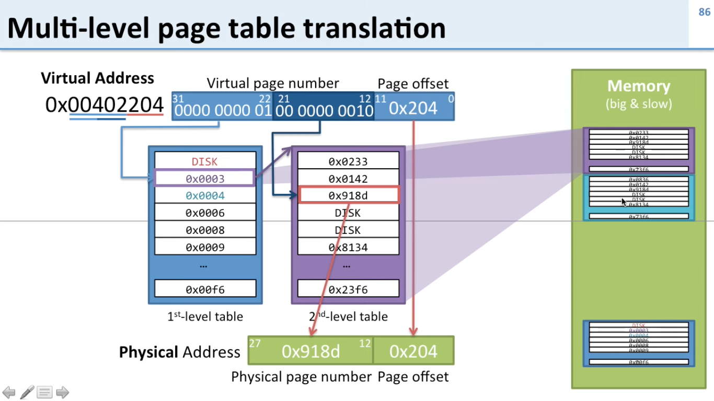
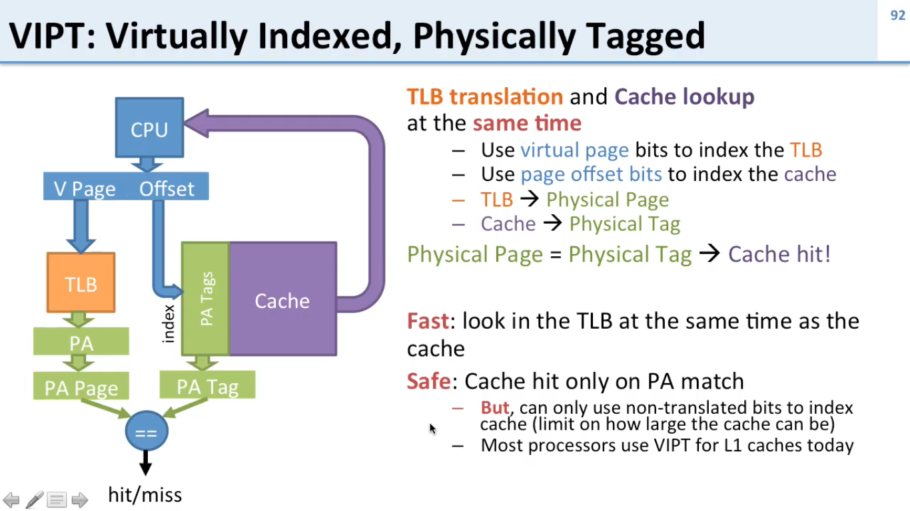

# [Virtual Memory](https://www.youtube.com/playlist?list=PLiwt1iVUib9s2Uo5BeYmwkDFUh70fJPxX)

Virtual Memory is a memory management technique that creates an illusion for each process that it has its own large, contiguous, and private address space, which is often much larger than the actual physical RAM (Random Access Memory) available in the system. The Operating System (OS) uses a combination of hardware (MMU) and software (the OS kernel) to abstract physical memory. 

The entire system relies on a hardware component called the Memory Management Unit (**MMU**) located on the CPU.

**Virtual Address Space (VAS)**: The memory space a process "sees." It's a linear array of bytes from address 0 to some maximum (e.g., 2^64 on 64-bit systems). This space is divided into fixed-size blocks called pages (typically 4KB in size).

## [Page Faults](https://youtu.be/A9WLYbE0p-I?si=EAxdb4q5gmEwnlET&t=589)
*   The MMU looks up the virtual page number in the page table.
*   When the requested page is **not in physical RAM**. This is called a **page fault**.
*   The MMU triggers a **page fault exception**, transferring control to the OS's page fault handler.
*   The OS takes over:
    *   **Locate the Page:** It checks its internal data structures to find where the page is stored on disk (in the swap file).
    *   **Find a Free Frame:** It needs a free physical frame to load the page into. If no free frame exists, it must run a **page replacement algorithm** (e.g., LRU - Least Recently Used) to select a "victim" page to evict from RAM.
    *   **Swap Out (If Needed):** If the victim page is "dirty" (has been modified), it must be written back to disk first.
    *   **Swap In:** The OS schedules a disk I/O operation to read the required page from disk into the free physical frame.
    *   **Update Page Table:** The OS updates the process's page table: marks the entry as Valid and sets the Physical Frame Number (PFN) to the new frame.
    *   **Restart Instruction:** The OS restarts the instruction that caused the page fault. This time, the translation will succeed (a page hit).

## Translation Lookaside Buffer (TLB) 
The TLB is a small, very fast hardware cache inside the (Memory Management Unit) MMU that stores recent virtual-to-physical page translations. It's the "first stop" for the MMU. A TLB hit avoids the slow page table walk in RAM. A TLB miss forces the MMU to check the page table in RAM.

