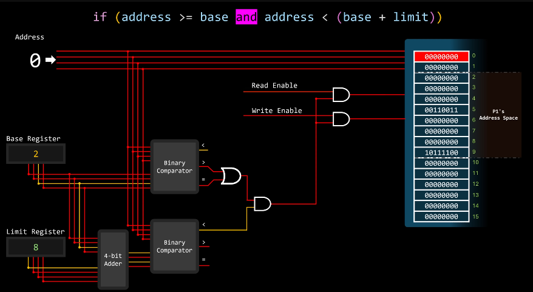

# [Memory Isolation](https://www.youtube.com/watch?v=Zmtxl7LZwjQ)

Base and Limit Registers (Simple, **Old-School**) - maybe used in microcontrollers



# [Virtual Memory](https://www.youtube.com/playlist?list=PLiwt1iVUib9s2Uo5BeYmwkDFUh70fJPxX)

Virtual Memory is a memory management technique that creates an illusion for each process that it has its own large, contiguous, and private address space, which is often much larger than the actual physical RAM (Random Access Memory) available in the system. The Operating System (OS) uses a combination of hardware (MMU) and software (the OS kernel) to abstract physical memory. 


The entire system relies on a hardware component called the Memory Management Unit (**MMU**) located on the CPU.

Excellent question. You've hit on a fundamental evolution in computer architecture and operating system design. The concepts are not mutually exclusive; in fact, they work together in a layered defense strategy.

The short answer is: 

Let's break this down.

### 1. The Core Misconception: Virtual Memory is a Concept, Not a Mechanism
…rules. |

You cannot have the security and stability of a multi-programming OS without the hardware mechanism. The kernel itself is just software; a rogue process could simply overwrite the kernel's memory if there were no hardware boundary. The hardware is the ultimate authority that ensures the kernel's rules are followed.


## [Page Faults](https://youtu.be/A9WLYbE0p-I?si=EAxdb4q5gmEwnlET&t=589)
*   The MMU looks up the virtual page number in the page table.
*   When the requested page is **not in physical RAM**. This is called a **page fault**.
*   The MMU triggers a **page fault exception**, transferring control to the OS's page fault handler.
*   The OS takes over:
    *   **Locate the Page:** It checks its internal data structures to find where the page is stored on disk (in the swap file).
    *   **Find a Free Frame:** It needs a free physical frame to load the page into. If no free frame exists, it must run a **page replacement algorithm** (e.g., LRU - Least Recently Used) to select a "victim" page to evict from RAM.
    *   **Swap Out (If Needed):** If the victim page is "dirty" (has been modified), it must be written back to disk first.
    *   **Swap In:** The OS schedules a disk I/O operation to read the required page from disk into the free physical frame.
    *   **Update Page Table:** The OS updates the process's page table: marks the entry as Valid and sets the Physical Frame Number (PFN) to the new frame.
    *   **Restart Instruction:** The OS restarts the instruction that caused the page fault. This time, the translation will succeed (a page hit).


## Translation Lookaside Buffer (TLB) 

In a system with virtual memory, every address generated by the CPU is a **virtual address (VA)**. This address must be translated by the Memory Management Unit (MMU) into a **physical address (PA)** before the data can be read from or written to physical RAM (or the cache).

The problem is that this translation takes time. To avoid this delay on every single memory access, the recent virtual-to-physical page translations is cached in a small, super-fast hardware cache inside the (Memory Management Unit) MMU called the **Translation Lookaside Buffer (TLB)**. It's the "first stop" for the MMU. A TLB hit avoids the slow page table walk in RAM. A TLB miss forces the MMU to check the page table in RAM. A TLB hit provides the Physical Frame Number (PFN) almost instantly.

But there's a second cache: the **data cache**, which stores copies of frequently accessed data from RAM. The critical question is: **Should the data cache be indexed and tagged using virtual addresses (VIVT) or physical addresses (PIPT)?**

## **The Solution: Virtually Indexed, Physically Tagged (VIPT)**

1.  The CPU generates a **Virtual Address (VA)**.
2.  Two operations happen **in parallel**:
    *   **Path A:** The VA's *index* bits are sent directly to the L1 cache to select a **cache set**. The cache reads out all the tags and data in that set.
    *   **Path B:** The VA is sent to the **TLB** to be translated into a **Physical Address (PA)**.
3.  The results arrive at the same time:
    *   From Path A, the cache has a set of physical tags (from the cache lines) that are potential matches.
    *   From Path B, the TLB provides the correct physical tag for the requested address.
4.  The cache controller **compares** the physical tag from the TLB with the physical tags read from the cache set.
5.  If they match, it's a **cache hit**, and the corresponding **data** is returned to the CPU. If not, it's a cache miss.


### **Worked Example with Values**

```
for eg- VA[31: 16] are the bits that will get translated to PA[31:16] .
and VA[15:0] is the page offset.

Let's design a 32 KiB, 2-way() associative VIPT cache.

Lets say 1 cache line will store 64 bytes, so VA[5:0] is the byte offset within a cache line.

Number of Cache Lines: Total Size / Line Size = 32768 bytes / 64 bytes/line = 512 lines.
Number of Sets: Number of Lines / Associativity = 512 lines / 2 ways/set = 256 sets. -> 8 bits needed -> VA[13:6] 

Ways are just telling that we can store atmost 2 different physical tags, for some same VA[13:0] address.

So cache will store entry corrosponding to VA[13:6] & its physical tag will
be PA[31:14] (used for comparison).


   32               22 21        16 15   14 13        6 5      0
  ├─────────────────────────────────────────────────────────────┤
  | VA[31:16] (VPN)  | VA[15:14]  | VA[13:6] (Index) | VA[5:0]  |
  ├─────────────────────────────────────────────────────────────┤
  |                  |            |                  |          |
  |   Virtual Tag    |  (Unused   |     Cache        |  Byte    |
  |   (for TLB)      | for Index) |     Index        |  Offset  |
  |                  |            |                  |          |
  └─────────────────────────────────────────────────────────────┘

```

The **Physical Tag** is not stored for free. Each of those 512 cache lines needs its own dedicated storage space to remember the physical address it corresponds to. This storage is a special memory called **Tag RAM**.

**So, the total physical silicon used for the cache is actually larger than 32 KiB.** It is:
`Total Cache Storage = (Data Storage) + (Tag RAM Storage) + (Metadata Storage)`

### Let's assume a CPU instruction wants to read from Virtual Address **`0x12345678`**.

**1. Virtual Address Breakdown:**
`VA = 0x12345678 = 0b0001_0010_0011_0100_0101_0110_0111_1000`

```
Bits (31-16): 0x1234 (VPN)
Bits (15-14): 0b01.... (value 0x1)
Bits (13-6):  0b01010110 (value 0x56)
Bits (5-0):   0b111000 (value 0x38)
```

**2. Parallel Cache & TLB Access:**
*   **Path A (Cache Indexing):**
    *   The CPU immediately takes `VA[13:6] = 0x56`.
    *   It goes to **cache set number `0x56`** (decimal 86) and reads the **physical tags** (e.g., `0x?????`) and data from the two cache lines in that set.
*   **Path B (TLB Translation):**
    *   The TLB translates the VPN `0x1234` to a Physical Frame Number (PFN). Let's assume the PFN is `0x0008_0000 >> 16 = 0x8000`.
    *   The full Physical Address is calculated: `PA = (PFN << 16) | Page_Offset = (0x8000 << 16) | 0x5678 = 0x80005678`.
    *   The **Physical Tag** is the upper 18 bits of the PA: `PA[31:14] = 0x80005678 >> 14 = 0x2000` (`0b0010_0000_0000_0000`).

**3. Comparison:**
*   The cache controller now has:
    *   The correct physical tag from the TLB: `0x2000`
    *   The physical tags from the cache ways in set `0x56`: e.g., `Way0_Tag = 0x2001`, `Way1_Tag = 0x2000`
*   It compares `0x2000` with the tags from the cache. **It finds a match in Way 1**.
*   **Cache Hit!** The data from Way 1 is selected. The byte offset `0x38` is used to pick the exact byte from the 64-byte line, and that byte is returned to the CPU.
