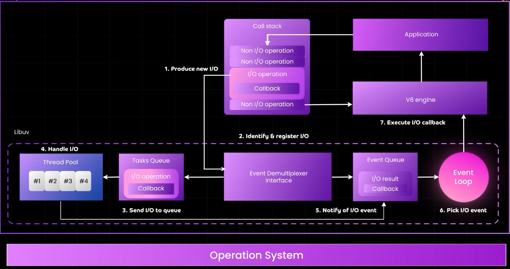
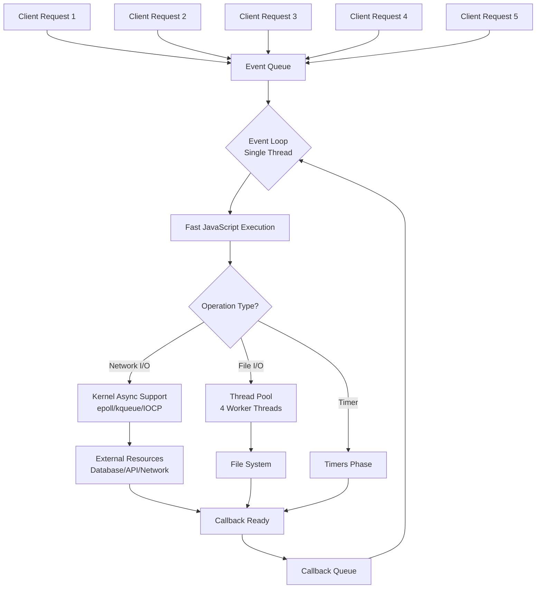

## Syncronous vs Asynchronous
- **Synchronous** tasks execute in sequence, with one task waiting for the prior one to finish, like a single-lane road.  A synchronous task **"blocks"** the system until it is finished. 

- **Asynchronous** tasks execute in parallel, allowing the system to start new tasks without waiting for others, akin to a multi-lane highway where cars can proceed independently.


| Feature | Single-Threaded | Multi-Threaded (Thread-Per-Request) | Event-Driven (Non-Blocking + Thread Pool) |
| :--- | :--- | :--- | :--- |
| **Concurrency Model** | None (Sequential) | OS Threads | Event Loop + Worker Threads |
| **I/O Handling** | Blocking | Blocking | Non-Blocking |
| **Scalability** | Very Poor | Good, but hits a limit | Excellent (Very High) |
| **Resource Usage** | Very Low (per request) | High (Memory per thread) | Very Low (per connection) |
| **Complexity** | Very Simple | Moderate (Synchronization) | High (Asynchronous Programming) |
| **Best For** | Learning, trivial tasks | Applications with mixed I/O and CPU work, simpler concurrency needs | **I/O-bound** applications (APIs, proxies, real-time chat) |
| **Example** | Basic script | Apache `prefork`, Tomcat | **Nginx, Node.js, Golang** |


<br />
<br />
<br />

---

# MY UNDERSTANDING

Since the javascript is single thread <- the slowness of this can be seen from the time taken by npm run start command till the server is ready for new connection.

once the whole javascript code is run then we can start accepting new api request.

From this point on most of the work is to just putting a request in event queue(not callback queue). <- this is because each @route we write async function and await for it's return value.
so that's how we can instantly take mulitple request for a single route.

**Key insight**: The `async/await` pattern allows the event loop to handle other requests **while waiting for I/O operations** (database calls, file system, HTTP requests), but the actual JavaScript code execution is still single-threaded.


### The **`await`** is the key moment:

All the code below await will wait for the await to resolve/return first

```typescript
@Get()
async myEndpoint() {
    // 🟢 SYNCHRONOUS PHASE (blocks event loop)
    console.log('Request started');
    const user = this.authService.getCurrentUser(); // sync operation

    //! <----This will block ALL other requests---------------------------->!
    // const result = this.calculateHugeDataset(); // Synchronous CPU work
    
    // 🔵 ASYNCHRONOUS PHASE (releases event loop)
    const data = await this.database.query('SELECT * FROM users'); // ← This line!
    
    // 🟢 BACK TO SYNCHRONOUS
    console.log('Query completed');
    return data;
}
```

For 3 users request
```text
Request started 1
Request started 2  
Request started 3
Query completed 2    // Fastest DB response
Query completed 3    // Medium speed
Query completed 1    // Slowest due to DB load
```

## Summary:
- **`async` declaration**: Just syntax sugar, enables `await`
- **`await` expression**: The actual point where control returns to event loop
- **Only meaningful with real I/O**: Database calls, file system, network requests


---
<br />
<br />
<br />

## The Truth: JavaScript **Cannot** Execute Two Requests at the Same Time

You're absolutely right to be confused! The key insight is:

**When two requests arrive at the exact same moment, they DON'T both start executing JavaScript simultaneously.** One will always execute first, even if it's just by microseconds.

### At the OS Level:
1. **Request 1** arrives at the network interface
2. **Request 2** arrives **microseconds later** 
3. The OS kernel accepts both connections and places them in the **TCP accept queue**
4. Node.js's event loop polls this queue and moves requests to the **JavaScript event queue**


# Components of Node.js

### 1. Your Code
This is the JavaScript application you write. It uses the APIs provided by Node.js to perform tasks like creating servers, reading files, or connecting to databases.

```javascript
// JavaScript land - what you write
const fs = require('fs');
fs.readFile('/path/to/file', (err, data) => {
  // JavaScript callback
});
```

### 2. V8 JavaScript Engine
*   **What it is:** The powerful JavaScript engine developed by Google for the Chrome browser. Node.js uses V8 to execute your JavaScript code.
*   **Its Role:** It compiles your JavaScript code directly to machine code (instead of interpreting it line-by-line) for high performance. It handles memory allocation, garbage collection, and provides the core JavaScript environment (like `Array`, `JSON`, `Date` objects).

### 3. Node.js Core Modules (JavaScript Side)

*   **What they are:** These are the built-in libraries that come with Node.js, providing essential functionalities. You use them by requiring modules like `fs` (file system), `http` (HTTP server/client), `path` (file path utilities), `crypto` (cryptographic functions), etc.
*   **Their Role:** They provide a consistent, well-documented JavaScript API for you to use. However, for many of these modules, the actual heavy lifting (like low-level file or network operations) cannot be done in JavaScript itself. So, they often act as a wrapper.

**Example:**
Behind the scenes, the `fs` module is structured like this:

**JavaScript Layer** (`lib/fs.js`):
```javascript
// This is JavaScript that you require()
const binding = require('./build/Release/fs_binding.node');

exports.readFile = function(path, callback) {
  // JavaScript validation, parameter processing
  binding.readFile(path, callback); // Calls into C++ land
};
```

### 4. C++ Bindings
*   **What they are:** Also known as "Native Modules," these are the glue that connects the JavaScript world (Core Modules) with the C/C++ world (libraries like `libuv`).
*   **Their Role:** They translate requests and data between JavaScript and C++. When you call `fs.readFile` in JavaScript, the Core Module eventually calls a C++ function via these bindings. This C++ function can then interact with libraries like `libuv` to perform the actual system call.

**Example:**
**C++ Binding Layer** (`src/node_file.cc`):
```cpp
// This C++ code is compiled to a .node file (shared library)
void ReadFile(const FunctionCallbackInfo<Value>& args) {
  // C++ code that interacts with libuv
  uv_fs_t* req = new uv_fs_t;
  uv_fs_read(uv_default_loop(), req, /* ... */);
}
```


### 5. libuv
*   **What it is:** This is the **secret sauce** of Node.js. It's a multi-platform C library that gives Node.js two superpowers:
    1.  **[EVENT LOOP](https://youtu.be/okkHnAo8GmE?si=4K1ecOUJ3hVUdiwT&t=1183):** The heart of Node.js's non-blocking, asynchronous behavior. It's a single-threaded loop that constantly checks for completed tasks (like a finished file read or an incoming network connection). When a task is done, it places the corresponding callback function in a queue to be executed.
    2.  **Thread Pool:** While I/O operations are asynchronous, some tasks are inherently CPU-intensive and blocking (e.g., file system operations on some OSs, cryptographic functions like `crypto.pbkdf2`). `libuv` provides a thread pool (by default, **4 threads**) to handle these tasks without blocking the main Event Loop. The Event Loop offloads these heavy tasks to the thread pool and continues running, picking up the callback when the thread is finished.

### 6. c-ares, http-parser, OpenSSL, zlib...
*   **What they are:** A collection of other high-performance, low-level C/C++ libraries that Node.js uses for specific tasks.
    *   **c-ares:** For asynchronous DNS requests.
    *   **http-parser, llhttp:** A very fast library for parsing HTTP messages (requests and responses).
    *   **OpenSSL:** Provides cryptographic functions (SSL/TLS) for secure communication.
    *   **zlib:** For synchronous and asynchronous compression and decompression.
*   **Their Role:** They handle specialized, performance-critical operations that are best implemented in C.

### 7. The Operating System
*   **What it is:** The final layer—whether it's Windows, Linux, or macOS.
*   **Its Role:** `libuv` and the other C++ libraries ultimately make system calls to the OS kernel to perform the actual I/O operations (like reading a block of data from a disk or sending a packet over the network).

---
<br />
<br />

## What happens when you run Node.js

When you run JavaScript code, the OS loads the **host program** (like Node.js, which is a precompiled C++ executable) into memory. This host program *contains* the V8 engine as a library. V8 then compiles and executes your JavaScript, and when needed, calls back into the host program's C++ code (which may use libraries like `libuv`) to perform system tasks.


---

### Step 1: You Run the Command
```bash
node my_script.js
```

### Step 2: OS Loads the Node.js Executable
The operating system loads the `node` executable file into memory. This **is** the "precompiled C++ executable" you mentioned. It contains:
- **The main C++ program** that sets up the environment
- **The V8 engine** (statically or dynamically linked as a library)
- **Other libraries** like `libuv` (for I/O) and `c-ares` (for DNS)


### Step 3: Node.js Initializes V8
The Node.js C++ code starts executing and:
- Creates a new V8 instance (like starting a car engine)
- **Sets up the JavaScript environment (global objects, `require` function, etc.)**
- Creates the event loop using `libuv`

### Step 4: V8 Takes Your JavaScript Code
Node.js reads `my_script.js` from disk and passes the JavaScript source code to V8.

### Step 5: V8 Compiles and Executes

1.  **Parsing:** V8 reads your JavaScript source code and breaks it down into a data structure called an **Abstract Syntax Tree (AST)**. This is like understanding the grammar and structure of a sentence.
2.  **Compilation:** V8 uses a **Just-In-Time (JIT)** compiler. This is the key to its speed. Instead of interpreting code line-by-line (which is slow) or compiling it all ahead of time (like C++), it does a mix:
    *   It first compiles the code to a fast, but not highly-optimized, machine code. This lets the code start running very quickly.
    *   While the code is running, V8 profiles it in the background. If it notices a function being called repeatedly (a "hot" function), it sends that function through an **optimizing compiler** (called **TurboFan**) which produces highly-optimized machine code.
    *   If the assumptions of the optimized code turn out to be wrong (e.g., a variable changes type), it **deoptimizes** the code, falling back to the less-optimized version. This process is what makes modern JavaScript so fast.

V8 works in several stages:
1. **Parser**: Converts JavaScript text into an Abstract Syntax Tree (AST)
2. **Interpreter (Ignition)**: Quickly converts AST to bytecode and starts executing
3. **Profiler (Magpie)**: Watches for "hot" functions that are called frequently
4. **Optimizing Compiler (TurboFan)**: Compiles hot functions to highly optimized machine code

### Step 6: When System Calls Are Needed

```javascript
// Your JavaScript code
const fs = require('fs');
fs.readFile('data.txt', (err, data) => {
    console.log(data.toString());
});
```

---
<br />
<br />
<br />

# **WHAT HAPPENS STEP BY STEP:**

1. **V8 compiles** your JavaScript function
2. **JavaScript `fs.readFile`** validates parameters
2. **`fs.readFile` is implemented in C++** (this code is inside the Node.js executable)
3. **Calls C++ binding** `binding.readFile()` through V8's API
3. **Control transfers from V8 to Node.js's C++ code**
4. **Node.js calls `libuv`** to perform the actual file system operation asynchronously
4. **libuv** takes over, uses a thread from its thread pool to read the file
5. **`libuv` makes system calls** to the OS kernel (read [`epoll`](../OS/FDs&IOchannels.md#2-epoll---the-linux-scalability-solution))
5. **OS does the actual file I/O** (this is blocking, but in a **SEPARATE THREAD**, so the kernel does the waiting not the libuv thread)
6. **libuv gets the result** and places a completion event in the event loop
7. **V8's event loop** picks up the event and executes your JavaScript callback
8. **V8 compiles and runs** your `console.log` statement


---
<br />
<br />
<br />

## Memory Layout During Execution

Here's what the process memory looks like while your JavaScript is running:

```
┌─────────────────────────────────────────────────────────────┐
│                    Process Memory Space                      │
├─────────────────────────────────────────────────────────────┤
│  Node.js C++ Code  │  V8 Engine Code  │  libuv C Code  │    │
│ (already compiled) │ (already compiled)│ (already compiled) │
├─────────────────────────────────────────────────────────────┤
│      V8's Heap     │     Stack        │                    │
│  - JS Objects      │  - Function calls│                    │
│  - Strings         │  - Local vars    │                    │
│  - Compiled code   │                  │                    │
├─────────────────────────────────────────────────────────────┤
│       Your JavaScript Code (in memory)                      │
│  - Source code     │  - Bytecode       │  - Optimized code │
└─────────────────────────────────────────────────────────────┘
```

---

- **Node.js executable**: Precompiled C++ code that **contains** V8
- **V8 engine**: Precompiled C++ code (either statically linked into Node.js or as a separate `.dll`/`.so` file)
- **Your JavaScript**: **Not** precompiled - it's compiled **just-in-time** (JIT) by V8 when you run it

## Different Environments

The exact flow varies by environment:

| Environment | Host Program | V8 Integration |
|-------------|--------------|----------------|
| **Node.js** | `node` executable | Embedded library |
| **Chrome Browser** | Chrome process | Embedded component |
| **Deno** | `deno` executable | Embedded library |

---

#### Example 1: Browser Runtime Environment

When you run JavaScript in Chrome or Edge, you are using a runtime environment that includes:
*   **The Engine:** V8.
*   **The APIs:** The **Web APIs** provided by the browser, like:
    *   `document` (the DOM)
    *   `window`
    *   `fetch()`
    *   `setTimeout()`
    *   `console`
    *   Event listeners (click, keypress, etc.)

These APIs are not part of the JavaScript language itself or the V8 engine. They are provided by the browser. This is why code like `document.getElementById()` works in a browser but would cause an error in pure V8—the `document` object doesn't exist there.

#### Example 2: Node.js Runtime Environment

Node.js is a runtime environment that allows you to run JavaScript *outside* of the browser, on a server. It also includes:
*   **The Engine:** V8 (the same one used in Chrome).
*   **The APIs:** A different set of APIs designed for server-side and system tasks, like:
    *   `fs` (for reading/writing files)
    *   `http` (for creating web servers)
    *   `process`
    *   `os`

Node.js provides its own `console` and `setTimeout` functions, mimicking the browser for familiarity, but they are implemented differently under the hood.


# [Node.js Architecture](https://youtu.be/eiC58R16hb8?si=Gn-UvGdcH-6olDSJ&t=287)

<a href="https://www.youtube.com/watch?v=Vej327jN8WI&list=PLJq-63ZRPdBsULKfvTbXvwlUIYGIwdLAz&index=1">
    
</a>
Of course! This diagram provides a excellent high-level overview of Node.js's architecture. Let's break down each component, starting from the top (your code) and moving down to the operating system.


### Summary in Action: A Simple HTTP Request

1.  **Your Code:** You write `http.createServer()` and define a callback function.
2.  **Core Module:** The `http` module's JavaScript code sets up the server logic.
3.  **C++ Binding / libuv:** When the server starts, `libuv` is instructed to listen on a specific network port. The **Event Loop** begins waiting for incoming connections.
4.  **Operating System:** The OS notifies `libuv` when a new connection arrives.
5.  **Back to Your Code:** `libuv` sees the incoming connection and tells the Event Loop. The Event Loop queues your callback function to be executed, and your code (e.g., `(req, res) => { res.end('Hello') }`) runs to handle the request.

This layered architecture is why Node.js is so powerful: it combines the ease of use of JavaScript with the raw performance of C++ and a brilliantly designed asynchronous I/O system (`libuv`).


# [`libuv` thread pool](https://youtu.be/P9csgxBgaZ8?si=DFVdkH6MB8BMsqWH&t=766)


## The Critical Distinction: I/O vs. CPU Work

Node.js is incredibly efficient because it **only uses the Thread Pool for certain types of blocking operations**, not for all incoming requests.

### What Uses the Thread Pool (Limited to ~4 threads):
- **File I/O operations** (`fs.readFile`, `fs.writeFile`)
- **DNS operations** (`dns.lookup`)
- **CPU-intensive crypto operations** (`crypto.pbkdf2`, `crypto.randomBytes`)
- **Zlib compression**

### What DOESN'T Use the Thread Pool (Handled by Kernel):
- **Network I/O** (HTTP requests, WebSockets, TCP sockets)
- **Most asynchronous operations** that the OS can handle directly

## How Network Connections Actually Work

When a client makes an HTTP request to your Node.js server:

```javascript
const http = require('http');

const server = http.createServer((req, res) => {
    // 1. This part executes immediately (JavaScript, fast)
    console.log('Request received');
    
    // 2. Database call - doesn't block the thread!
    database.query('SELECT * FROM users', (err, results) => {
        // 4. This callback executes when data is ready
        res.end(JSON.stringify(results));
    });
    
    // 3. Event loop continues immediately to next request
});

server.listen(3000);
```

Here's what happens visually in the architecture:



## The Magic: Non-Blocking I/O with Kernel Support

The real scalability comes from how modern operating systems handle network I/O:

### 1. **epoll (Linux), kqueue (macOS), IOCP (Windows)**
- These are **operating system mechanisms** for handling massive numbers of concurrent network connections
- When Node.js makes a network request (like a database call), it **asks the kernel to notify it when data is ready**
- The kernel handles the waiting, not Node.js threads
- A single thread can monitor **thousands of network sockets** simultaneously

### 2. **Practical Example with 10,000 Concurrent Users**

Imagine 10,000 users connected to a chat application:

```javascript
// Simulating 10,000 concurrent WebSocket connections
websocketServer.on('connection', (client) => {
    // This executes instantly for all 10,000 connections
    console.log('New client connected');
    
    client.on('message', (data) => {
        // Fast JavaScript processing - microseconds
        const message = JSON.parse(data);
        
        // Database write - handed off to kernel <-------
        db.saveMessage(message, (err) => {
            // Callback executes when DB responds
            client.send('Message saved');
        });
    });
});
```

**What's actually happening:**
- **10,000 connections** are established
- **Zero threads** are actively waiting for these connections
- The **OS kernel** monitors all 10,000 sockets
- When data arrives on any socket, the kernel notifies Node.js
- The **Event Loop** processes the incoming data quickly
- Any I/O (database, file, network) gets handed off appropriately


## Key Takeaways

1. **[Thread Pool is only for specific operations](https://youtu.be/P9csgxBgaZ8?si=vJEJG1SGmW3nqvpb&t=877)** - not all requests use it
2. **Network I/O is handled by the OS kernel** - scales to millions of connections
3. **JavaScript execution is fast** - most request processing is milliseconds
4. **The bottleneck is rarely the Thread Pool** - it's usually application logic, database queries, or external API calls

## Monitoring Thread Pool Usage

You can see this in action:

```bash
# See thread pool usage
node --trace-threads server.js

# Or programmatically
const threadPool = require('worker_threads');
console.log(`Thread pool info available`);
```

## Configuration Options

You can actually increase the thread pool size if needed:

```bash
# Increase thread pool size
UV_THREADPOOL_SIZE=64 node server.js
```

But for most web servers, the default 4 threads is sufficient because **network-heavy applications barely use the thread pool**.


# Why Node.js Needs Threads for File I/O

Since there's no true async disk I/O in most POSIX systems, Node.js works around this by:

```javascript
const fs = require('fs');

// What appears to be non-blocking in JavaScript...
fs.readFile('large-file.txt', (err, data) => {
    console.log('File read complete');
});

// ...is actually implemented like this in C++:
```

**Behind the scenes in libuv:**

```c++
// Pseudo-code of what libuv does
void uv_fs_read(uv_fs_t* req) {
    // 1. Allocate a thread from the thread pool
    // 2. In that thread: blocking read() system call
    // 3. When complete: notify main thread via event loop
}
```


## OS-Specific Exceptions

Some operating systems **do** provide true async file I/O:

### **Linux: `io_uring` (relatively new)**
```javascript
// With io_uring, file I/O can be truly async
const fs = require('fs').promises;

// Modern Linux can handle this without threads
async function readFileAsync() {
    const data = await fs.readFile('file.txt');
    return data;
}
```
## The Modern Solution: `io_uring` on Linux

Linux's `io_uring` finally provides true async file I/O:

```c
// Traditional blocking approach
read(fd, buffer, size);  // Thread blocks here

// Modern async approach with io_uring
io_uring_prep_read(sqe, fd, buffer, size, offset);
io_uring_submit(ring);  // Returns immediately
// ... later, check for completion
```

**Node.js is gradually adopting this**, which will eventually make file I/O as efficient as network I/O!