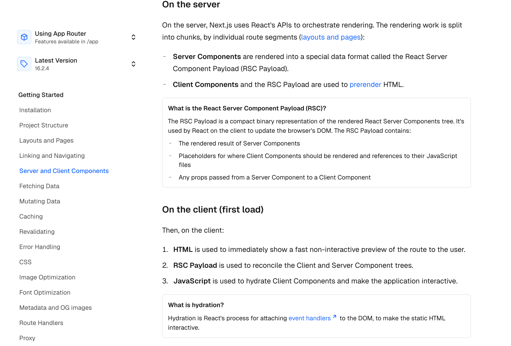

# [Nest.js](https://www.youtube.com/watch?v=k7o9R6eaSes)

**Next.js** is a popular open-source web development framework built on top of **React**. While React is a library for building user interfaces, Next.js provides the "architecture" and tools needed to build full-scale, production-ready web applications.

### What is Next.js?

Often called "The React Framework for the Web," Next.js simplifies the development process by handling complex features out of the box that you would otherwise have to configure manually in a standard React app.

- **Rendering Options:** It allows for Server-Side Rendering (SSR), Static Site Generation (SSG), and Incremental Static Regeneration (ISR), which makes websites much faster and better for SEO.
- **File-Based Routing:** You don't need a separate library like React Router; any file added to the `app` or `pages` directory automatically becomes a route.
- **Full-Stack Capabilities:** It allows you to write backend code (API routes) in the same project as your frontend.
- **Optimization:** It automatically optimizes images, fonts, and scripts to improve performance.

---

### What Build Tool Does it Use?

It kinda itself act as a buildtool, Next.js uses a combination of powerful tools to compile, bundle, and optimize your code. As of 2025, the framework is in a transition period between two major technologies:

#### 1. The Compiler: SWC

Next.js uses **SWC** (Speedy Web Compiler) as its primary compiler. SWC is written in **Rust** and is significantly faster than the older industry standard, Babel. It handles:

- **Transpilation:** Turning modern JavaScript/TypeScript into code browsers can understand.
- **Minification:** Shrinking your code size for production.

#### 2. The Bundler: Turbopack & Webpack

The "bundler" is what takes all your individual files and packages them together.

- **Turbopack (The New Standard):** Developed by Vercel (the creators of Next.js), Turbopack is an incremental bundler written in Rust. In the latest versions of Next.js (like version 15 and 16), it is the default for local development because it is up to **700x faster** than Webpack for large projects.
- **Webpack (The Legacy Standard):** For years, Webpack was the default. While Next.js is moving toward Turbopack for everything, Webpack is still used for production builds in many configurations or if you have custom plugins that haven't migrated to the Turbo ecosystem yet.

### Server Action

- **Without `"use server"`:** The function is just private code inside the house. The browser has no way to "call" it.
- **With `"use server"`:** You are telling Next.js to build a hidden bridge (an HTTP POST endpoint). When the user clicks the button, the browser sends a request across that bridge to execute that specific function on the server.

<br />
<br />
<br />

# [Metadata](https://nextjs.org/docs/app/getting-started/metadata-and-og-images)

### **The `generateMetadata` Function in Next.js (App Router)**

The `generateMetadata` function is an asynchronous function used to dynamically generate metadata (like **title**, **description**, and **openGraph** tags) for a specific route segment based on fetched data or route parameters. This is crucial for SEO and web shareability.

- **Server Components Only:** `generateMetadata` can only be exported from **Server Components** (within `layout.js` or `page.js` files).
- **Dynamic Metadata:** Unlike a static `metadata` object, this function runs at request time (or build time for static generation) and can perform data fetching to populate the metadata fields dynamically.
- **Automatic Head Tag Generation:** Next.js automatically resolves the returned data and generates the appropriate `<head>` tags for the page.

- **Parameters:** The function receives route `params` and `searchParams` as arguments, allowing access to dynamic route segments and URL query parameters.
- **Data Fetching:** Next.js and React automatically **memoize** `fetch` requests within `generateMetadata` and the page component itself, so the same data is only fetched once, even if called in multiple places.

```javascript
// generateMetadata function
export const generateMetadata = async ({ params }: { params: { slug: string } }): Promise<Metadata> => {
  const product = await getProduct(params.slug);

  return {
    title: product.name,
    description: product.description,
    openGraph: {
        images: product.thumbnail,
    },
  };
};

// Page component
const Page = async ({ params }: { params: { slug: string } }) => {
  const product = await getProduct(params.slug); // Data fetching is memoized

  return (
    <div>
      <h1>{product.name}</h1>
      <p>{product.description}</p>
    </div>
  );
};
```

- **Streaming Metadata:** For dynamic pages, Next.js can stream the UI first and inject the metadata into the `<body>` later, which improves perceived performance. However, for search engine bots, it ensures the metadata is present in the `<head>` tag when the initial HTML is served.
- **Merging:** Metadata defined in nested layouts and pages is automatically merged, with child segments overriding parent fields for the same key.

---

[](https://nextjs.org/docs/app/getting-started/server-and-client-components)

## Loading.js

| Component Type | Wrapped by `loading.js`? | Behavior |
| :--- | :--- | :--- |
| **`page.tsx`** | **YES** | The most common use case. |
| **Nested Routes** | **YES** | Wraps all sub-pages unless they have their own `loading.js`. |
| **`layout.tsx`** | **NO** | The layout stays static while the loading state replaces the children. |
| **Internal Components** | **NO** | Components *inside* the page must be manually wrapped in `<Suspense>` if they fetch data independently. |


> When you prefix a variable with `NEXT_PUBLIC_`(even in .env file), Next.js inlines the value into the browser's JavaScript bundle during the build process.

## Error: `useSearchParams()` should be wrapped in a suspense boundary

1. **Static Rendering by Default**: To make your application as fast as possible, Next.js tries to statically pre-render all of your pages at build time.
2. **Missing Information at Build Time**: The `useSearchParams()` hook relies on the URL query string (like `?lat=12&lng=77`). Because the URL can change depending on the user, Next.js has no way of knowing what these search parameters will be when it is building the app.
3. **The Bailout**: If Next.js encounters `useSearchParams()` without a `<Suspense>` boundary, it throws its hands up and says "I can't statically build this page." It will then bail out of static rendering and fallback to rendering the entire page dynamically on the client-side at runtime, which hurts performance.
4. **How Suspense Fixes It**: By wrapping the component that consumes `useSearchParams()` inside a `<Suspense>` boundary, you are telling Next.js: "Go ahead and statically build the rest of the layout right now. When the user actually visits the page, show the fallback temporarily, and then execute this specific block of code on the client side once you know the real search params."


<!-- TODO -->

* https://nextjs.org/docs/app/api-reference/config/next-config-js
* https://nextjs.org/docs/app/api-reference/functions/generate-static-params