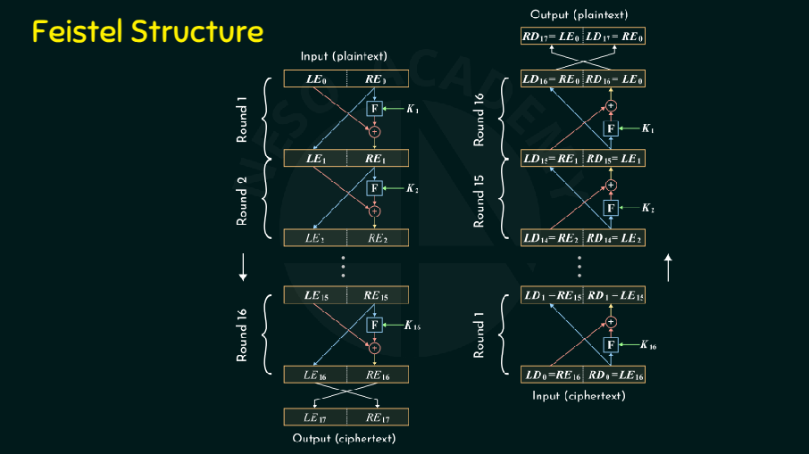
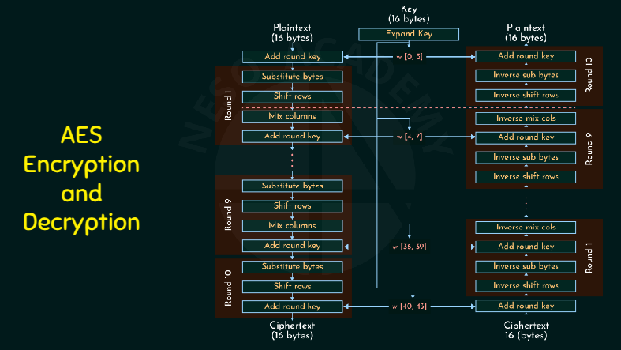

**Forward Secrecy (FS)**, also known as **Perfect Forward Secrecy (PFS)**, is a security feature in cryptographic systems that ensures session keys are not compromised even if long-term private keys (like server keys) are later exposed.

1. **Session-Specific Keys**: If an attacker records encrypted traffic and later obtains the server’s private key, they cannot decrypt past sessions because each session used a different key.
2. **Ephemeral Key Exchange**: Protocols like **Diffie-Hellman Ephemeral (DHE)** or **Elliptic Curve Diffie-Hellman Ephemeral (ECDHE)** are used to establish session keys.
3. **No Long-Term Storage**: The temporary keys are discarded after the session ends.

## **[Diffie-Hellman Key Exchange (DHKE)](https://www.youtube.com/watch?v=Yjrfm_oRO0w)**  

- Allows two parties to securely establish a shared secret key over an insecure channel.  
- Used in protocols like SSL/TLS, SSH, and IPsec.  

#### **Key Concepts**:  
We know that $g^{ab} = (g^a)^b = (g^b)^a$ and goal is to derive $g^{ab}$, we ask other person to calcuate $g^b$ and give it to us so that we can then do the rest of the calcuation and raise it to power $a$. Idea is that it's hard to get $b$ from $g^b mod\ p$. Ofcourse every thing is taken $mod\ p$ here.

**TODO** - why modulo needs to be prime, -> some Chinese remainder theorm shit.

1. **Public Parameters**:  
   - Large prime number $p$ (modulus).  
   - Generator $g$ (primitive root modulo $p$).  

2. **Private & Public Keys**:  
   - Each party selects a **private key** ($a$ for Alice, $b$ for Bob).  
   - Computes **public key**:  
     - Alice: $A = g^a \mod p$  
     - Bob: $B = g^b \mod p$  

3. **Shared Secret Calculation**:  
   - Alice computes: $S = B^a \mod p$  
   - Bob computes: $S = A^b \mod p$  
   - Both arrive at the same **shared secret** $S = g^{ab} \mod p$.  

#### **Security**:  
- Relies on the **Discrete Logarithm Problem (DLP)** (hard to find $a$ from $A = g^a \mod p$).  
- Vulnerable to **Man-in-the-Middle (MITM) attacks** if not authenticated. You still needs authentication to verify the sender's identity (Parties exchange public keys beforehand or get from a trusted source / Digital signatures/ Certificates).

## **[Elliptic Curve Diffie-Hellman (ECDH)](https://www.youtube.com/watch?v=NF1pwjL9-DE)**
Uses elliptic curves for better efficiency. [Explaination & Backdoor.. ? ?](https://youtu.be/gAtBM06xwaw?si=EHyGRPuZRtm8DhLK&t=367) [Backdoor.. ? ?](https://youtu.be/ulg_AHBOIQU?si=RGoVzXdO4-0JfkiI&t=337) [Backdoor.. ? ?](https://www.youtube.com/watch?v=nybVFJVXbww&t=630s)

ECC is considered asymmetric because it involves public-private key pairs, even though the shared secret is symmetric, but the key exchange mechanism is not.

#### **Key Concepts**  
- **Elliptic Curve (EC):** A mathematical structure defined by the equation:  
  $ y^2 = x^3 + ax + b $ (over a finite field).  
- **Private Key (d):** A randomly selected integer (kept secret).  
- **Public Key (Q):** Computed as $ Q = d \times G $, where $G $ is the base point (generator).  

#### **ECDH Key Exchange Steps**  
1. **Key Generation:**  
   - Alice & Bob generate their private & public keys:  
     - Alice: $ (d_A, Q_A = d_A \times G) $  
     - Bob: $ (d_B, Q_B = d_B \times G) $  
2. **Public Key Exchange:**  
   - Alice sends $ Q_A $ to Bob, Bob sends $ Q_B $ to Alice.  
3. **Shared Secret Computation:**  
   - Alice computes: $ S = d_A \times Q_B $  
   - Bob computes: $ S = d_B \times Q_A $  
   - Both arrive at the same point $ S = d_A \times d_B \times G $.  
4. **Derive Symmetric Key:**  
   - Use the x-coordinate (or hash) of $ S $ as the shared key.  

#### **Security**  
- Relies on the **Elliptic Curve Discrete Logarithm Problem (ECDLP)**.  
- Eavesdroppers cannot compute $ d_A $ or $ d_B $ from $ Q_A, Q_B $.  
- Provides **forward secrecy** if ephemeral keys are used (ECDHE).  

#### **Advantages over Classic DH**  
- **Shorter key sizes** for equivalent security (e.g., 256-bit ECC ≈ 3072-bit RSA/DH).  
- **Faster computations**, lower resource usage.  

## [Data Encryption Standard (DES)](https://www.youtube.com/watch?v=bRBuBJ8IAF4) - Based on Feistel Network  

DES is a symmetric block cipher. By 'symmetric', we mean that the size of input text and output text (ciphertext) is same (64-bits). 

- The main key length is 64-bit which is transformed into 56-bits by skipping every 8th bit in the key.
- It encrypts the text in 16 rounds where each round uses 48-bit subkey.
- This 48-bit subkey is generated from the 56-bit effective key.
- The same algorithm and key are used for both encryption and decryption with minor changes.

### [Key schedule](https://en.wikipedia.org/wiki/Data_Encryption_Standard#Key_schedule),  [S-Box](https://youtu.be/khFqzQVuYRQ?si=s2j5xyCn1bTZBcCh&t=16), [The Feistel (F) function](https://en.wikipedia.org/wiki/Data_Encryption_Standard#The_Feistel_(F)_function)

### **Key Weaknesses**  
- **Short Key Length (56-bit)**: Brute-force attacks are feasible. Modern GPUs/ASICs can crack DES in **hours** (e.g., EFF’s 1998 crack took 56 hours; today, services like crack.sh promise ~26 hours) .  
- **Weak Keys**: 4 out of 256 keys (e.g., all 0s/1s) produce identical round keys, reducing security .  
- **S-box Vulnerabilities**: Certain S-boxes (e.g., S-box 4) allow output manipulation via specific input bits .  

### **Known Attacks**  
- **Brute-Force**: Primary threat due to small key space.  **NSA** pressured **IBM** to reduce the key from 64 to 56 bits, enabling brute-force attacks. 
- **Differential Cryptanalysis**: Discovered in 1990; DES’s S-boxes were later revealed to be hardened against it (NSA’s tweak) . **NSA’s role** was paradoxical: they hardened S-boxes but weakened key length.  
- **Linear Cryptanalysis**: Requires ~2⁴³ known plaintexts; impractical but theoretically viable .

### Decryption

DES decryption is identical to encryption, but with reversed subkey order (K₁₆ → K₁). The Feistel structure makes this possible. Even if the round function 
$F$ is **non-invertible** (e.g., a hash function), the Feistel structure ensures reversibility. Each round’s transformation is invertible due to XOR properties. You can confirm it from below diagram.

In feistel structure, **Half of the data remains unmodified in each round**, which can limit diffusion but simplifies design.

## [Advanced Encryption Standard (AES)](https://www.youtube.com/watch?v=gP4PqVGudtg) - Based on Substitution-Permutation Network  

At present, there is no known practical attack that would allow someone without knowledge of the key to read data encrypted by AES when correctly implemented.

Each round (except the last) consists of:  
1. **SubBytes** – Non-linear substitution using S-box.  
2. **ShiftRows** – Cyclic shifting of rows.  
3. **MixColumns** – Linear transformation of columns.  
4. **AddRoundKey** – XOR with round key(128- bit).  

**Final Round** omits **MixColumns**. 

**Decryption Process**  
Perform Inverse operations in reverse order:  **InvSubBytes, InvShiftRows, InvMixColumns, AddRoundKey**  

## AES 256 (for high security environments, slower than AES-128bit)

- **Initial Round (Round 0 - the only main difference) :** The input plaintext (128 bits) is XORed with the first round key (the original **256-bit** key is **split** and processed).
- **Main Rounds (Rounds 1 to 13)**
- **Final Round (Round 14)**